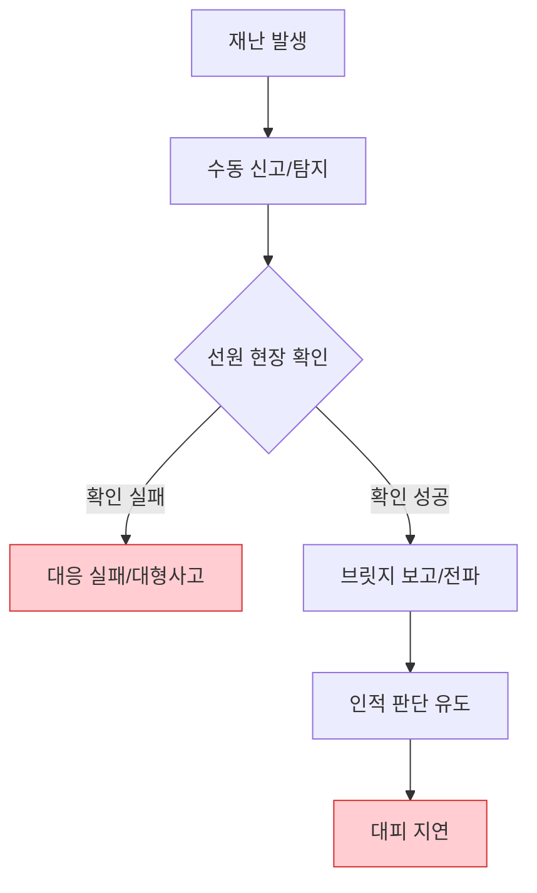
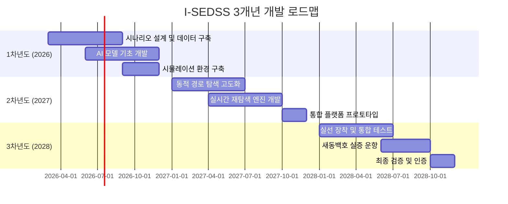

# I-SEDSS 사업계획서
## 지능형 선박 화재 피난 유도 및 의사결정 지원 시스템

> **과제명**: 지능형 선박 화재 안전 지원 시스템 (I-SEDSS: Intelligent Ship Evacuation & Decision Support System)  
> **주관기관**: (주)오든 (ODN)  
> **공동연구기관**: (주)한빛안전기술, 해양수산과학기술연구조합, 전남대학교, 한국건설생활환경시험연구원(KCL)  
> **연구기간**: 2026년 ~ 2028년 (3개년)

---

## 목차

1. [연구개발과제의 필요성](#1-연구개발과제의-필요성)
2. [연구개발과제의 목표 및 내용](#2-연구개발과제의-목표-및-내용)
3. [연구개발과제의 추진전략·방법 및 추진체계](#3-연구개발과제의-추진전략방법-및-추진체계)
4. [연구개발성과의 활용방안 및 기대효과](#4-연구개발성과의-활용방안-및-기대효과)
5. [연구개발성과의 사업화 전략 및 계획](#5-연구개발성과의-사업화-전략-및-계획)
6. [평가기준 및 평가방법](#6-평가기준-및-평가방법)

---

## 1. 연구개발과제의 필요성

### 1.1 기술적 필요성

#### 1.1.1 선박 화재 대응의 구조적 한계

선박은 **"폐쇄된 강철 미로"**라는 특수한 환경적 제약을 가지며, 육상 대비 화재 대응이 **10배 이상 치명적**인 것으로 분석됩니다.

| 구분 | 현황 | 문제점 |
|:---:|:---|:---|
| **초동 대응** | 화재 인지 후 대응까지 평균 30분 지연 | 골든타임 소실로 인명피해 확대 |
| **데이터 블라인드** | CCTV 사각지대 존재, 농연 발생 시 시야 차단 | 내부 고립자 및 화원 위치 파악 불가 |
| **대피 경로 경직성** | 고정된 안내 표지판 의존 | 패닉 상태 승객의 위험 구역 유입 |



#### 1.1.2 기존 시스템의 5대 한계점

| 번호 | As-Is (기존) | 문제점 설명 |
|:---:|:---|:---|
| 1 | 인적 판단 및 경험 의존 | 승조원의 주관적 경험에만 의존하여 초동 대응 골든타임 소실 |
| 2 | 분절된 파편화 인프라 | 감지기, 유도등, 관제가 개별 동작하여 재난 상황 통합 인지 불가 |
| 3 | 박제된 정적 대피 경로 | 사고 위치나 연기 확산을 반영하지 못하는 고정식 대피 안내 |
| 4 | 해상 통신 인프라 한계 | 원거리 항해 시 육상 관제 및 외부 기관과의 실시간 데이터 단절 |
| 5 | 사후 기록용 데이터 관리 | 데이터가 대응이 아닌 사고 후 원인 규명용(Blackbox)으로만 유휴 |

### 1.2 사회·경제적 필요성

#### 1.2.1 해양 사고 피해 현황

- **세월호 참사 (2014)**: 304명 사망·실종, 초기 대피 지시 부재가 인명피해 확대의 직접 원인
- **연간 해양 화재 사고**: 국내 연평균 120건 이상 발생, 인명피해 및 재산손실 지속
- **국제해사기구(IMO) 통계**: 전 세계 선박 화재 사고의 70%가 초기 대응 실패로 대형 재난으로 확대

#### 1.2.2 경제적 손실 규모

```
┌─────────────────────────────────────────────────────────────┐
│  연간 해양 화재 사고 경제적 손실 (추정)                      │
├─────────────────────────────────────────────────────────────┤
│  • 직접 피해(선박, 화물)    : 약 5,000억 원                  │
│  • 간접 피해(운항 중단)     : 약 3,000억 원                  │
│  • 인명피해 사회적 비용     : 산정 불가 (무한대 가치)        │
│  • 환경오염 복구 비용       : 약 2,000억 원                  │
├─────────────────────────────────────────────────────────────┤
│  총 연간 손실액 (추정)      : 약 1조 원 이상                 │
└─────────────────────────────────────────────────────────────┘
```

### 1.3 정책적 필요성

#### 1.3.1 국내 정책 동향

| 정책/법규 | 내용 | I-SEDSS 대응 |
|:---|:---|:---|
| 해사안전법 개정 (2020) | 여객선 안전관리체계 강화 | 지능형 안전 시스템 적용 |
| 스마트 해운물류 발전계획 | 2030 자율운항선박 상용화 | 자율운항 연동 안전 플랫폼 |
| K-해양안전 종합대책 | 선박 화재 예방 및 대응체계 고도화 | AI 기반 실시간 화재 대응 |

#### 1.3.2 국제 규제 동향

- **IMO SOLAS II-2**: 선박 화재 안전 국제협약 강화 추세
- **EU Maritime Safety**: 2025년부터 첨단 화재 감지 시스템 의무화 논의
- **DNV GL/Lloyd's Register**: 스마트십 인증 기준에 AI 안전 시스템 포함

---

## 2. 연구개발과제의 목표 및 내용

### 1) 연구개발과제의 최종 목표

#### 핵심 목표

> **"AI 기반 실시간 화재 감지 → 동적 대피경로 생성 → 지능형 피난유도"를 통합한 선박 화재 안전 지원 시스템 개발 및 실선 실증 (TRL 7 달성)**

```
┌──────────────────────────────────────────────────────────────────────────┐
│                        I-SEDSS 핵심 가치 체계                              │
├──────────────────────────────────────────────────────────────────────────┤
│                                                                           │
│    ┌─────────┐    ┌─────────┐    ┌─────────┐    ┌─────────┐             │
│    │  수 집  │ ━▶ │  분 석  │ ━▶ │  전 파  │ ━▶ │  유 도  │             │
│    │ Sensing │    │ Analysis│    │ Notify  │    │ Guidance│             │
│    └─────────┘    └─────────┘    └─────────┘    └─────────┘             │
│         │              │              │              │                   │
│    멀티센서      AI 화재감지      통합관제      동적 LED               │
│    LiDAR/열화상   위험도 평가     모바일 알림    경로 유도               │
│                                                                           │
└──────────────────────────────────────────────────────────────────────────┘
```

#### 최종 목표 성과물

| 구분 | 목표 | 달성 기준 |
|:---|:---|:---|
| **다중변수 대피경로 탐색 모델** | AI 기반 실시간 재탐색 S/W 시제품 | 탐색 정확도 90% 이상, 3초 이내 |
| **통합 의사결정 지원 모듈** | 중앙관제/유도등 연동 인터페이스 | 오차율 5% 미만 |
| **실시간 피난유도 시스템** | 승조원/승객 단말 연동 앱 | 실증 대피 일치율 85% 이상 |

### 2) 연구개발과제의 단계별 목표

#### 전체 로드맵 (2026-2028)



#### 연차별 상세 목표

| 연차 | 핵심 목표 | 주요 산출물 | TRL |
|:---:|:---|:---|:---:|
| **1차년도** | AI 대피경로 탐색 및 기초 시스템 구축 | 시나리오 DB, 기초 AI 모델, 시뮬레이션 환경 | TRL 4→5 |
| **2차년도** | 실시간 대피경로 재탐색 모델 고도화 | 동적 재탐색 엔진, 통합 플랫폼 프로토타입 | TRL 5→6 |
| **3차년도** | 선박 실증 및 지능형 SOP 확정 | 실선 실증 완료, 인증 획득, SOP 문서화 | TRL 6→7 |

### 3) 연구개발과제의 내용

#### 3.1 핵심 연구 내용

##### 3.1.1 다중변수 대피경로 탐색 모델 개발

| 세부 내용 | 설명 |
|:---|:---|
| **시나리오 기반 데이터셋 구축** | 화재, 침수, 폭발 등 10개 이상 재난 시나리오 정의 및 시뮬레이션 데이터 생성 |
| **GNN/DPOP 기반 경로 탐색** | 그래프 신경망을 활용한 최적 경로 탐색 알고리즘 개발 |
| **FDS 연동 화재 확산 예측** | Fire Dynamics Simulator 연동으로 3초 단위 화재 확산 예측 |

##### 3.1.2 AI 화재 감지 및 센서 퓨전 기술

```
┌────────────────────────────────────────────────────────────────┐
│                    멀티모달 센서 퓨전 아키텍처                    │
├────────────────────────────────────────────────────────────────┤
│                                                                 │
│   ┌──────────┐  ┌──────────┐  ┌──────────┐  ┌──────────┐      │
│   │ LiDAR    │  │ 열화상   │  │ 연기감지 │  │ CCTV     │      │
│   │ 3D Point │  │ Thermal  │  │ Smoke    │  │ Visual   │      │
│   └────┬─────┘  └────┬─────┘  └────┬─────┘  └────┬─────┘      │
│        │             │             │             │              │
│        └──────────┬──┴─────────────┴──┬──────────┘              │
│                   │                    │                         │
│              ┌────▼────────────────────▼────┐                   │
│              │    Sensor Fusion Engine       │                   │
│              │    (Edge Node Processing)     │                   │
│              └──────────────┬───────────────┘                   │
│                             │                                    │
│                      ┌──────▼──────┐                            │
│                      │  AI 화재    │                            │
│                      │  판정 엔진  │                            │
│                      └─────────────┘                            │
└────────────────────────────────────────────────────────────────┘
```

##### 3.1.3 지능형 피난유도 시스템

| 구성요소 | 기능 | 기술 사양 |
|:---|:---|:---|
| **동적 LED 유도등** | 실시간 경로 변경에 따른 방향 지시 | RGB LED, 저조도 가시성 확보 |
| **모바일 단말 앱** | 승조원/승객 개인별 대피 경로 안내 | iOS/Android, UWB 위치추적 연동 |
| **브릿지 통합 관제** | 3D 디지털 트윈 기반 종합 상황 전시 | WebGL 기반 실시간 렌더링 |

##### 3.1.4 설명 가능한 AI (XAI) 시스템

```
┌─────────────────────────────────────────────────────────────────┐
│                    XAI 의사결정 검증 체계                         │
├─────────────────────────────────────────────────────────────────┤
│                                                                  │
│    AI 판단      →    XAI 추론 설명    →    인간 검증/승인        │
│                                                                  │
│    ┌─────────┐      ┌─────────────┐      ┌─────────────┐       │
│    │ 경로 A  │  ⇨   │ "경로 A가   │  ⇨   │ 선장 최종   │       │
│    │ 추천    │      │  연기 회피 및│      │ 승인/수정  │       │
│    └─────────┘      │  최단거리"   │      └─────────────┘       │
│                      └─────────────┘                             │
│                                                                  │
│    신뢰도: 92%       요인 분석:                                  │
│                      - 연기 농도 회피 (40%)                      │
│                      - 최단 거리 (35%)                           │
│                      - 혼잡도 회피 (25%)                         │
└─────────────────────────────────────────────────────────────────┘
```

### 4) 연구개발과제 수행일정 및 주요 결과물

#### 간트 차트 (Gantt Chart)

| 연구 내용 | 1차년도 | | | | 2차년도 | | | | 3차년도 | | | |
|:---|:---:|:---:|:---:|:---:|:---:|:---:|:---:|:---:|:---:|:---:|:---:|:---:|
| | Q1 | Q2 | Q3 | Q4 | Q1 | Q2 | Q3 | Q4 | Q1 | Q2 | Q3 | Q4 |
| 시나리오 설계 | ██ | ██ | | | | | | | | | | |
| 데이터셋 구축 | | ██ | ██ | ██ | | | | | | | | |
| AI 모델 개발 | | | ██ | ██ | ██ | ██ | | | | | | |
| 시뮬레이션 환경 | | | | ██ | ██ | | | | | | | |
| 동적 재탐색 엔진 | | | | | ██ | ██ | ██ | | | | | |
| 통합 플랫폼 개발 | | | | | | ██ | ██ | ██ | | | | |
| 하드웨어 설치 | | | | | | | | ██ | ██ | | | |
| 실선 통합 테스트 | | | | | | | | | ██ | ██ | ██ | |
| 최종 검증/인증 | | | | | | | | | | | ██ | ██ |

#### 연차별 주요 결과물

| 연차 | 결과물 | 유형 | 비고 |
|:---:|:---|:---:|:---|
| 1차년도 | 재난 시나리오 데이터셋 (10종 이상) | DB | PyroSim/Pathfinder 데이터 |
| 1차년도 | 기초 AI 대피경로 탐색 모델 v1.0 | S/W | Python/TensorFlow |
| 2차년도 | 실시간 재탐색 엔진 v2.0 | S/W | Edge 최적화 버전 |
| 2차년도 | 통합 관제 플랫폼 프로토타입 | S/W | Web 기반 |
| 3차년도 | 새동백호 실증 보고서 | 문서 | 성능 검증 결과 |
| 3차년도 | 지능형 SOP 매뉴얼 | 문서 | 표준 운영 절차 |

---

## 3. 연구개발과제의 추진전략·방법 및 추진체계

### 1) 연구개발과제의 추진전략⋅방법

#### 3.1.1 핵심 추진 전략

```
┌─────────────────────────────────────────────────────────────────────────┐
│                      I-SEDSS 4대 핵심 전략 기술                          │
├─────────────────────────────────────────────────────────────────────────┤
│                                                                          │
│   ┌─────────────────┐         ┌─────────────────┐                       │
│   │  1. 이기종 센서  │         │  2. 초저지연    │                       │
│   │    지능화       │         │   분산 연산     │                       │
│   │  ─────────────  │         │  ─────────────  │                       │
│   │  LiDAR+열화상+  │         │  Edge Node 기반 │                       │
│   │  CCTV 퓨전     │         │  실시간 처리    │                       │
│   └─────────────────┘         └─────────────────┘                       │
│                                                                          │
│   ┌─────────────────┐         ┌─────────────────┐                       │
│   │  3. XAI 기반    │         │  4. 글로벌 초   │                       │
│   │    신뢰 확보    │         │   연계 네트워크 │                       │
│   │  ─────────────  │         │  ─────────────  │                       │
│   │  설명가능 AI로  │         │  Starlink+LTE   │                       │
│   │  인간 최종 판단 │         │  하이브리드     │                       │
│   └─────────────────┘         └─────────────────┘                       │
│                                                                          │
└─────────────────────────────────────────────────────────────────────────┘
```

#### 3.1.2 기술 개발 방법론

| 단계 | 방법 | 도구/플랫폼 |
|:---|:---|:---|
| **시나리오 설계** | IMO MSC.1/Circ.1238 가이드라인 준수 | PyroSim, Pathfinder |
| **데이터 생성** | FDS 기반 Synthetic Data 생성 | Fire Dynamics Simulator |
| **AI 모델 개발** | GNN, Transformer 기반 경로 탐색 | PyTorch, TensorFlow |
| **시뮬레이션** | 디지털 트윈 연동 성능 검증 | Unity, Unreal Engine |
| **실증** | 새동백호 실선 장착 및 해상 테스트 | 실선 운항 환경 |

#### 3.1.3 리스크 관리 전략

```
┌───────────────────────────────────────────────────────────────┐
│              리스크 관리 매트릭스 (Risk Matrix)                │
├───────────────┬───────────────────┬───────────────────────────┤
│   리스크      │   완화 전략       │   대응 방안              │
├───────────────┼───────────────────┼───────────────────────────┤
│ 통신 두절    │ 자율 Edge 운영    │ 로컬 AI 독립 판단 모드   │
│ 센서 고장    │ 센서 이중화       │ 인접 센서 대체 알고리즘  │
│ AI 오판단    │ XAI 인간 검증     │ 선장 최종 Override 권한  │
│ 정전/화재    │ UPS + 내화 설계   │ 비상 전원 30분 이상 확보 │
└───────────────┴───────────────────┴───────────────────────────┘
```

### 2) 연구개발과제의 추진체계

#### 3.2.1 컨소시엄 구성도

```
                           ┌─────────────────────┐
                           │    (주)오든 (ODN)   │
                           │   ───────────────   │
                           │   주관기관 (총괄)   │
                           │   • 시스템 통합     │
                           │   • 플랫폼 개발     │
                           └──────────┬──────────┘
                                      │
          ┌───────────────────────────┼───────────────────────────┐
          │                           │                           │
          ▼                           ▼                           ▼
┌─────────────────┐         ┌─────────────────┐         ┌─────────────────┐
│ (주)한빛안전기술│         │  해양수산과학   │         │   전남대학교    │
│  ─────────────  │         │ 기술연구조합    │         │  ─────────────  │
│  AI Core &     │         │  ─────────────  │         │ 디지털 트윈 &  │
│  Edge 개발     │         │ 인프라 구축 &   │         │ 선박 도메인    │
└─────────────────┘         │ 실증 지원       │         └─────────────────┘
                            └─────────────────┘
                                      │
                                      ▼
                           ┌─────────────────────┐
                           │        KCL          │
                           │   ───────────────   │
                           │   인증/검증 (V&V)   │
                           │   • IEC 60945 인증  │
                           │   • 해상 환경 시험  │
                           └─────────────────────┘
```

#### 3.2.2 기관별 역할 분담

| 기관 | 역할 | 주요 담당 업무 |
|:---|:---:|:---|
| **(주)오든** | 주관 | 총괄 PM, 시스템 통합, 플랫폼 개발, 실증 총괄 |
| **(주)한빛안전기술** | 공동 | AI 엔진 개발, Edge Node 설계, 센서 퓨전 알고리즘 |
| **해양수산과학기술연구조합** | 공동 | 실증 선박 인프라 구축, 통신 네트워크, 현장 지원 |
| **전남대학교** | 공동 | 디지털 트윈 개발, 선박 구조 모델링, 시뮬레이션 |
| **KCL** | 공동 | 인증 시험, 해상 환경 검증, V&V 프로세스 |

#### 3.2.3 실증 선박: 새동백호

| 항목 | 사양 |
|:---|:---|
| **선명** | 새동백호 (Sae-Dongbaek) |
| **선종** | 카페리 (Car Ferry) |
| **총톤수** | 약 10,000 GT |
| **운항 노선** | 목포 ↔ 제주 |
| **실증 내용** | 전 구역 센서 설치, 통합 관제 시스템 운영 |

---

## 4. 연구개발성과의 활용방안 및 기대효과

### 1) 연구개발성과의 활용방안

#### 4.1.1 단계별 활용 계획

| 단계 | 기간 | 활용 방안 |
|:---|:---:|:---|
| **1단계** | 2026-2028 | 새동백호 실증을 통한 기술 검증 및 고도화 |
| **2단계** | 2029-2030 | 국내 여객선 우선 적용 확대 (30척 목표) |
| **3단계** | 2031~ | 글로벌 시장 진출 (크루즈, 화물선 등) |

#### 4.1.2 주요 활용 분야

```
┌─────────────────────────────────────────────────────────────────┐
│                    I-SEDSS 활용 분야 확장                         │
├─────────────────────────────────────────────────────────────────┤
│                                                                  │
│   ┌─────────────┐    ┌─────────────┐    ┌─────────────┐        │
│   │   여객선    │    │  크루즈선   │    │   화물선    │        │
│   │  ─────────  │    │  ─────────  │    │  ─────────  │        │
│   │ 국내 연안   │    │ 대형 국제   │    │ LNG/유조선  │        │
│   │ 카페리      │    │ 크루즈      │    │ 컨테이너선  │        │
│   └─────────────┘    └─────────────┘    └─────────────┘        │
│          │                  │                  │                │
│          └──────────────────┼──────────────────┘                │
│                             │                                    │
│                    ┌────────▼────────┐                          │
│                    │  자율운항선박   │                          │
│                    │  ─────────────  │                          │
│                    │ MASS Level 3~4  │                          │
│                    │ 통합 안전 시스템│                          │
│                    └─────────────────┘                          │
│                                                                  │
└─────────────────────────────────────────────────────────────────┘
```

#### 4.1.3 기술 이전 및 라이선싱

| 기술 항목 | 이전 대상 | 예상 시기 |
|:---|:---|:---:|
| AI 화재 감지 알고리즘 | 국내 조선소, 해운사 | 2029년 |
| 동적 경로 탐색 엔진 | 글로벌 해양 안전 기업 | 2030년 |
| 통합 관제 플랫폼 | 선급/인증기관 | 2030년 |

### 2) 연구개발성과의 기대효과

#### 4.2.1 정량적 기대효과

| 지표 | 현재 (As-Is) | 목표 (To-Be) | 개선율 |
|:---|:---:|:---:|:---:|
| **화재 감지 시간** | 10분 이상 | 30초 이내 | **95% 단축** |
| **대피 시작 시간** | 15분 | 2분 | **87% 단축** |
| **대피 완료 시간** | 40분 | 15분 | **63% 단축** |
| **골든타임 확보율** | 30% | 90% | **200% 향상** |

```
┌───────────────────────────────────────────────────────────────────┐
│              골든타임 단축 효과 비교 (Time-to-Response)             │
├───────────────────────────────────────────────────────────────────┤
│                                                                    │
│  기존 시스템 (As-Is)                                               │
│  ┌───────┬───────┬───────┬───────┬───────────────────────────────┐│
│  │ 감지  │ 확인  │ 보고  │ 판단  │         대피 시작            ││
│  │ 5min  │ 5min  │ 5min  │ 10min │         ... (30분 경과)      ││
│  └───────┴───────┴───────┴───────┴───────────────────────────────┘│
│                                                                    │
│  I-SEDSS (To-Be)                                                   │
│  ┌─────┬─────┬───────────────────────────────────────────────────┐│
│  │감지 │분석 │       즉시 대피 유도 시작 (2분 이내)              ││
│  │30s  │90s  │       ◀━━━━━━━ 28분 단축 ━━━━━━━▶                ││
│  └─────┴─────┴───────────────────────────────────────────────────┘│
│                                                                    │
└───────────────────────────────────────────────────────────────────┘
```

#### 4.2.2 정성적 기대효과

| 구분 | 기대효과 |
|:---|:---|
| **인명 안전** | 선박 화재 시 인명피해 최소화, 골든타임 내 대피 완료 |
| **기술 자립** | 해양 안전 분야 국산 AI 기술 확보 |
| **산업 경쟁력** | 스마트십/자율운항선박 시장 선점 |
| **사회적 신뢰** | 해운 산업에 대한 국민 안전 신뢰 회복 |

#### 4.2.3 경제적 파급효과

| 항목 | 산출 근거 | 예상 효과 |
|:---|:---|---:|
| **직접 매출** | 국내 30척 × 5억원 | 150억 원 |
| **해외 수출** | 글로벌 100척 × 7억원 | 700억 원 |
| **유지보수** | 연간 구독형 서비스 | 50억 원/년 |
| **피해 예방** | 사고 1건당 100억 원 절감 | 300억 원/년 |

---

## 5. 연구개발성과의 사업화 전략 및 계획

### 1) 국내외 시장 동향

#### 5.1.1 글로벌 스마트십 시장

```
┌─────────────────────────────────────────────────────────────────────┐
│               글로벌 스마트 해운 시장 규모 전망                       │
├─────────────────────────────────────────────────────────────────────┤
│                                                                      │
│   (단위: 억 달러)                                                    │
│                                                                      │
│   250 ┤                                           ████████          │
│       │                                    ████████████████          │
│   200 ┤                              ██████████████████████          │
│       │                       ███████████████████████████           │
│   150 ┤                ████████████████████████████████████          │
│       │         ███████████████████████████████████████████          │
│   100 ┤  █████████████████████████████████████████████████          │
│       │  ████████████████████████████████████████████████           │
│    50 ┤  ███████████████████████████████████████████████            │
│       │  ██████████████████████████████████████████████             │
│     0 ┼──────────────────────────────────────────────────           │
│         2023   2024   2025   2026   2027   2028   2029   2030       │
│                                                                      │
│   CAGR: 12.5% (2023-2030)                                           │
│   2030년 예상 시장 규모: 250억 달러 (약 32조 원)                     │
└─────────────────────────────────────────────────────────────────────┘
```

#### 5.1.2 경쟁사 현황 분석

| 경쟁사 | 국가 | 주요 기술 | I-SEDSS 대비 차별점 |
|:---|:---:|:---|:---|
| Kongsberg | 노르웨이 | 자율운항 통합 시스템 | 화재 대응 특화 부족 |
| Wärtsilä | 핀란드 | 항해 최적화 솔루션 | AI 피난유도 기능 無 |
| ABB Marine | 스위스 | 추진/전력 관리 | 안전 시스템 별도 구성 |
| **I-SEDSS** | **한국** | **AI 화재 감지 + 동적 대피** | **End-to-End 통합** |

### 2) 지식재산권, 표준화 및 인증기준 현황

#### 5.2.1 특허 확보 전략

| 순번 | 특허명 (예정) | 출원 시기 | 권리범위 |
|:---:|:---|:---:|:---|
| 1 | AI 기반 선박 화재 실시간 감지 방법 및 장치 | 2026 Q2 | 한국, PCT |
| 2 | 동적 대피경로 재탐색 알고리즘 | 2027 Q1 | 한국, 미국, EU |
| 3 | XAI 기반 해상 의사결정 지원 시스템 | 2027 Q3 | 한국, PCT |
| 4 | 멀티모달 센서 퓨전 화재 검출 방법 | 2028 Q1 | 한국, 미국 |

#### 5.2.2 인증 현황 및 계획

| 인증/규격 | 내용 | 취득 계획 |
|:---|:---|:---:|
| **IEC 60945** | 해상 항해 장비 일반 요구사항 | 2028년 |
| **SOLAS II-2** | 선박 화재 안전 국제협약 | 2028년 |
| **ISO 19847** | 선박 데이터 표준 | 2028년 |
| **선급 인증** | KR, DNV, Lloyd's | 2029년 |

### 3) 표준화 전략

#### 5.3.1 표준화 추진 계획

```
┌─────────────────────────────────────────────────────────────────┐
│                    표준화 추진 로드맵                            │
├─────────────────────────────────────────────────────────────────┤
│                                                                  │
│  2026-2027: 국내 표준 제안                                       │
│  ├─ KS 표준(안) 개발 및 제안                                    │
│  └─ 해양수산부 가이드라인 협력                                   │
│                                                                  │
│  2028-2029: 국제 표준 참여                                       │
│  ├─ IMO 회의 기술 제안서 제출                                   │
│  ├─ ISO TC 8 (선박 및 해양기술) 참여                            │
│  └─ IEC TC 80 (해양 항해 장비) 표준안 제출                      │
│                                                                  │
│  2030+: 글로벌 표준 확산                                         │
│  └─ I-SEDSS 기반 국제 표준 채택 추진                            │
│                                                                  │
└─────────────────────────────────────────────────────────────────┘
```

### 4) 사업화 계획

#### 5.4.1 사업화 일정

| 단계 | 기간 | 주요 활동 |
|:---|:---:|:---|
| **기술 완성** | 2026-2028 | R&D 과제 수행, 실선 실증 완료 |
| **사업화 준비** | 2028-2029 | 인증 취득, 양산 설계, 파트너십 구축 |
| **국내 사업화** | 2029-2030 | 국내 여객선 30척 공급 목표 |
| **글로벌 진출** | 2030~ | 아시아, 유럽, 북미 시장 진출 |

#### 5.4.2 수익 모델

```
┌─────────────────────────────────────────────────────────────────┐
│                     I-SEDSS 수익 모델                            │
├─────────────────────────────────────────────────────────────────┤
│                                                                  │
│   ┌────────────────┐        ┌────────────────┐                  │
│   │  하드웨어 판매 │        │  소프트웨어    │                  │
│   │  ────────────  │        │  라이선스      │                  │
│   │  센서, Edge    │        │  ────────────  │                  │
│   │  Node 등       │        │  플랫폼 사용권 │                  │
│   │                │        │                │                  │
│   │  예상: 50%     │        │  예상: 30%     │                  │
│   └────────────────┘        └────────────────┘                  │
│                                                                  │
│   ┌────────────────┐        ┌────────────────┐                  │
│   │  연간 유지보수 │        │  기술 컨설팅   │                  │
│   │  ────────────  │        │  ────────────  │                  │
│   │  SaaS 구독형   │        │  맞춤형 개발   │                  │
│   │  업데이트      │        │  교육 훈련     │                  │
│   │                │        │                │                  │
│   │  예상: 15%     │        │  예상: 5%      │                  │
│   └────────────────┘        └────────────────┘                  │
│                                                                  │
└─────────────────────────────────────────────────────────────────┘
```

#### 5.4.3 매출 전망

| 연도 | 국내 | 해외 | 합계 (억원) |
|:---:|---:|---:|---:|
| 2029 | 50 | 0 | 50 |
| 2030 | 100 | 50 | 150 |
| 2031 | 150 | 200 | 350 |
| 2032 | 200 | 400 | 600 |
| 2033 | 250 | 600 | 850 |

---

## 6. 평가기준 및 평가방법

### 1) 성과지표 및 목표치

#### 6.1.1 정량적 성과지표

| 구분 | 성과지표 | 목표치 | 가중치 |
|:---|:---|:---:|:---:|
| **특허 출원** | 국내외 특허 출원 건수 | 4건 | 10% |
| **특허 등록** | 국내외 특허 등록 건수 | 2건 | 15% |
| **S/W 등록** | 소프트웨어 저작권 등록 | 4건 | 10% |
| **시제품 (TRL 7)** | 실선 실증 시스템 | 1식 | 20% |
| **시제품 (TRL 6)** | 통합 플랫폼 프로토타입 | 1식 | 15% |
| **논문 게재** | SCI급 학술지 게재 | 3편 | 10% |
| **인력 양성** | 석박사 배출 | 4명 | 10% |
| **만족도 조사** | 전문가/현장 평가 | 90점 이상 | 10% |

#### 6.1.2 정성적 성과 목표

| 구분 | 목표 내용 |
|:---|:---|
| **기술 완성도** | TRL 7 수준의 실선 적용 가능한 시스템 완성 |
| **현장 적합성** | 새동백호 실증을 통한 실사용 환경 검증 |
| **확장 가능성** | 다양한 선종 및 글로벌 시장 적용 가능한 설계 |
| **안전성 검증** | IEC/SOLAS 규격 적합성 인증 |

### 2) 성능지표 및 측정방법

#### 6.2.1 핵심 성능지표 (KPI)

| 순번 | 성능지표 | 단위 | 목표치 | 측정방법 |
|:---:|:---|:---:|:---:|:---|
| 1 | 시나리오 타당성 | 점 | 90 이상 | PHA 기반 위험성 평가 |
| 2 | 경로 탐색/재탐색 정확도 | % | 90 이상 | 시뮬레이션 비교 검증 |
| 3 | 의사결정 추론 정확성 | 점 | 80 이상 | BLR/GLM 결정 오차율 분석 |
| 4 | 도면 인식 정확도 | F1 | 0.9 이상 | Faster R-CNN 평가 |
| 5 | 밀집도 추정 오차 | MAE | 5% 이하 | LiDAR 데이터 검증 |
| 6 | 실증 대피 일치율 | % | 85 이상 | 실선 훈련 결과 비교 |
| 7 | 외부 정보 연계 | 종 | 2 이상 | API 연동 확인 |
| 8 | 데이터 응답 지연 | 초 | 5 이하 | NTP 동기화 측정 |
| 9 | 실증 시나리오 건수 | 건 | 3 이상 | 실선 훈련 횟수 |
| 10 | 전문가 만족도 | 점 | 80 이상 | Likert 5점 척도 설문 |

#### 6.2.2 검증 환경 및 도구

| 성능지표 | 검증 환경 | 검증 도구 |
|:---|:---|:---|
| 시나리오 타당성 | 새동백호 BIM 모델 | Pathfinder, PyroSim |
| 경로 탐색 정확도 | 디지털 트윈 환경 | Unity, FDS 연동 |
| 의사결정 정확성 | 선박 브릿지 시뮬레이터 | 시나리오 20회 반복 |
| 도면 인식 | GA 도면 400+ 데이터셋 | Faster R-CNN, SAM |
| 밀집도 추정 | LiDAR 실측 데이터 | ShanghaiTech 벤치마크 |
| 실증 대피 일치율 | 새동백호 실선 | UWB 위치추적, VR 훈련 |
| 시스템 응답 지연 | 고부하 시나리오 | JMeter, NTP 동기화 |
| 전문가 만족도 | 선장/해기사 30명 | 온라인 설문 |

#### 6.2.3 단계별 검증 계획

```
┌─────────────────────────────────────────────────────────────────┐
│                    단계별 검증 체계 (V&V)                        │
├─────────────────────────────────────────────────────────────────┤
│                                                                  │
│   1차년도: 기초 검증 (Unit Test)                                 │
│   ├─ 개별 알고리즘 정확도 검증                                  │
│   └─ 시뮬레이션 환경 기반 테스트                                │
│                                                                  │
│   2차년도: 통합 검증 (Integration Test)                          │
│   ├─ 모듈 간 연동 테스트                                        │
│   ├─ 디지털 트윈 기반 시나리오 검증                             │
│   └─ Edge-Cloud 통신 안정성 테스트                              │
│                                                                  │
│   3차년도: 실증 검증 (Field Test)                                │
│   ├─ 새동백호 실선 장착 및 운항 테스트                          │
│   ├─ 실제 대피 훈련 시행 (3회 이상)                             │
│   ├─ IEC/SOLAS 인증 시험                                        │
│   └─ 전문가 평가 및 만족도 조사                                 │
│                                                                  │
└─────────────────────────────────────────────────────────────────┘
```

---

## 부록

### A. 용어 정의

| 용어 | 정의 |
|:---|:---|
| **I-SEDSS** | Intelligent Ship Evacuation & Decision Support System |
| **TRL** | Technology Readiness Level (기술 성숙도) |
| **FDS** | Fire Dynamics Simulator (화재 동역학 시뮬레이터) |
| **GNN** | Graph Neural Network (그래프 신경망) |
| **XAI** | Explainable Artificial Intelligence (설명 가능한 AI) |
| **SOLAS** | Safety of Life at Sea (해상 인명 안전 협약) |
| **IMO** | International Maritime Organization (국제해사기구) |
| **MASS** | Maritime Autonomous Surface Ships (자율운항선박) |

### B. 참고문헌

1. IMO MSC.1/Circ.1238 - Guidelines for Evacuation Analysis for New and Existing Passenger Ships
2. SOLAS Chapter II-2 - Construction – Fire Protection, Fire Detection and Fire Extinction
3. IEC 60945 - Maritime Navigation and Radiocommunication Equipment and Systems
4. ISO 19847 - Ships and Marine Technology – Shipboard Data Servers to Share Field Data at Sea

---

> **문서 작성일**: 2026년 2월  
> **버전**: v1.0  
> **작성 기관**: (주)오든 (ODN)
