# I-SEDSS 사업계획서
## 지능형 선박 화재 피난 유도 및 의사결정 지원 시스템

> **과제명**: 지능형 선박 화재 안전 지원 시스템 (I-SEDSS: Intelligent Ship Evacuation & Decision Support System)  
> **주관기관**: (주)오든 (ODN)  
> **공동연구기관**: (주)한빛안전기술, 해양수산과학기술연구조합, 전남대학교, 한국건설생활환경시험연구원(KCL)  
> **연구기간**: 2026년 ~ 2028년 (3개년)

---

## 목차

1. [연구개발과제의 필요성](#1-연구개발과제의-필요성)
2. [연구개발과제의 목표 및 내용](#2-연구개발과제의-목표-및-내용)
3. [연구개발과제의 추진전략·방법 및 추진체계](#3-연구개발과제의-추진전략방법-및-추진체계)
4. [연구개발성과의 활용방안 및 기대효과](#4-연구개발성과의-활용방안-및-기대효과)
5. [연구개발성과의 사업화 전략 및 계획](#5-연구개발성과의-사업화-전략-및-계획)
6. [평가기준 및 평가방법](#6-평가기준-및-평가방법)

---

## 1. 연구개발과제의 필요성

### 1.1 기술적 필요성

#### 1.1.1 선박 화재 대응의 구조적 한계

선박 환경에서의 화재는 육상 건물과는 본질적으로 다른 특수한 도전 과제를 안고 있습니다. 선박은 본질적으로 **"폐쇄된 강철 미로"**라는 구조적 특성을 가지고 있어, 일반 건물 화재 대비 **대응 난이도가 10배 이상** 높은 것으로 분석됩니다.

특히 대형 여객선의 경우, 수직으로 여러 층이 쌓여 있고, 각 층마다 복잡한 복도와 객실이 미로처럼 얽혀 있습니다. 여기에 기관실, 화물창, 주방 등 화재 위험이 높은 공간들이 선체 곳곳에 분포하고 있어, 화재 발생 시 연기와 열이 빠르게 확산되면서 대피 경로가 순식간에 차단될 수 있습니다.

| 구분 | 현황 | 문제점 |
|:---:|:---|:---|
| **초동 대응** | 화재 인지 후 대응까지 평균 30분 지연 | 골든타임 소실로 인명피해 확대 |
| **데이터 블라인드** | CCTV 사각지대 존재, 농연 발생 시 시야 차단 | 내부 고립자 및 화원 위치 파악 불가 |
| **대피 경로 경직성** | 고정된 안내 표지판 의존 | 패닉 상태 승객의 위험 구역 유입 |

현재 선박 안전 시스템의 가장 큰 문제는 **"인지 → 확인 → 보고 → 판단"**이라는 순차적 과정에서 발생하는 병목 현상입니다. 아래 다이어그램은 기존 시스템의 대응 흐름과 그 한계를 보여줍니다.

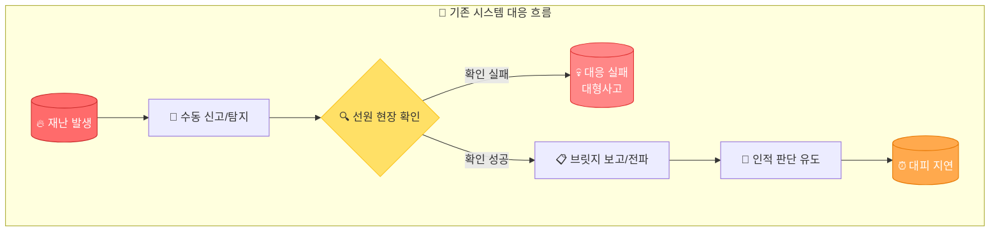

이 과정에서 각 단계마다 5~10분의 지연이 발생하며, 결과적으로 **화재 발생 후 실제 대피가 시작되기까지 30분 이상**이 소요되는 것이 현실입니다. 이는 선박 화재에서 가장 중요한 **"골든타임(Golden Time)"**을 완전히 소실시키는 치명적인 구조적 문제입니다.

#### 1.1.2 기존 시스템의 5대 한계점

현재 선박에 탑재된 안전 시스템들은 대부분 1990년대~2000년대 초반에 설계된 기술에 기반하고 있습니다. 이들 시스템은 개별적으로는 일정 수준의 기능을 수행하지만, **통합적인 재난 대응**이라는 관점에서는 심각한 한계를 보이고 있습니다.

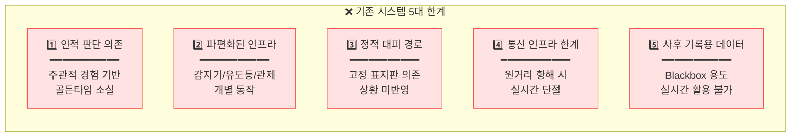

**첫째**, 현재 시스템은 **인적 판단과 경험에 과도하게 의존**하고 있습니다. 화재 발생 시 연기 감지기가 작동하더라도, 실제 화재 여부 확인과 대응 결정은 전적으로 승조원의 경험과 판단에 맡겨집니다. 야간이나 악천후 시, 경험이 부족한 승조원이 당직인 경우 초동 대응이 크게 지연될 수 있습니다.

**둘째**, 선박 내 안전 장비들이 **분절된 파편화 인프라**로 운영되고 있습니다. 연기 감지기, 스프링클러, 비상 유도등, CCTV, 방송 시스템 등이 각각 독립적으로 동작하여, 재난 상황을 종합적으로 인지하고 대응하는 것이 불가능합니다.

**셋째**, 대피 경로 안내가 **고정된 정적 시스템**에 의존합니다. 벽면에 부착된 비상구 표지판과 유도등은 화재 위치나 연기 확산 방향을 전혀 고려하지 못합니다. 패닉 상태의 승객들이 표지판만 보고 오히려 화재 방향으로 이동하는 2차 피해가 빈번히 발생합니다.

**넷째**, **해상 통신 인프라의 본질적 한계**가 있습니다. 연안이 아닌 원양 항해 중에는 육상 관제센터나 해경과의 실시간 데이터 교환이 사실상 불가능합니다. 위성 통신이 가능하더라도 대역폭 제한으로 영상이나 대용량 센서 데이터 전송은 어렵습니다.

**다섯째**, 현재 수집되는 데이터는 대부분 **사후 기록용(Blackbox)**으로만 활용됩니다. VDR(Voyage Data Recorder)에 저장된 정보는 사고 후 원인 규명에는 활용되지만, 실시간 대응에는 전혀 기여하지 못하는 "쓰고 버리는" 구조입니다.

### 1.2 사회·경제적 필요성

#### 1.2.1 해양 사고 피해 현황과 교훈

대한민국은 2014년 세월호 참사라는 뼈아픈 경험을 통해 해상 안전의 중요성을 처절하게 깨달았습니다. **304명의 소중한 생명**이 희생된 이 사고는 단순한 침몰 사고가 아니라, **초기 대피 지시의 부재와 잘못된 의사결정**이 피해를 기하급수적으로 확대시킨 대표적인 사례입니다.

사고 당시 승객들에게 "가만히 있으라"는 방송이 나간 것은 선박의 상태, 탈출 가능 시간, 최적 대피 경로 등에 대한 **정확한 데이터 기반 의사결정 시스템이 부재**했기 때문입니다. 만약 AI가 선박의 경사각, 침수 진행 상황, 각 구역별 승객 분포를 실시간으로 분석하여 "즉시 상갑판으로 대피하라"는 지시를 자동으로 내렸다면, 훨씬 많은 생명을 구할 수 있었을 것입니다.

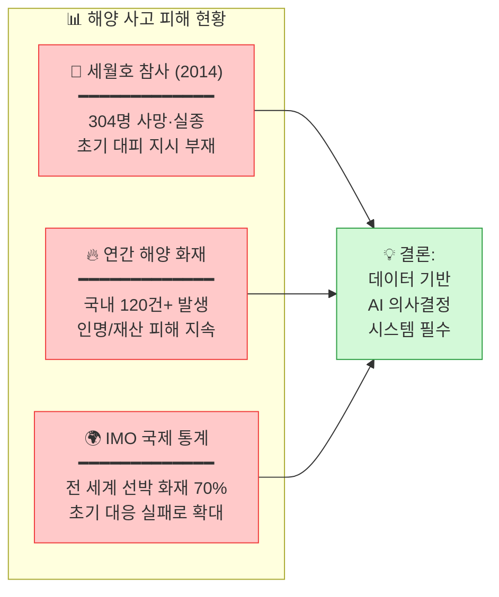

국내에서는 세월호 외에도 **연평균 120건 이상의 해양 화재 사고**가 발생하고 있습니다. 국제해사기구(IMO) 통계에 따르면, 전 세계 선박 화재 사고의 **70%가 초기 대응 실패**로 인해 소형 화재에서 대형 재난으로 확대됩니다. 이는 현재의 수동적, 경험 의존적 대응 체계가 근본적인 한계에 봉착했음을 명백히 보여줍니다.

#### 1.2.2 경제적 손실 규모

해양 화재 사고로 인한 경제적 손실은 단순히 선박과 화물의 물리적 피해에 그치지 않습니다. 운항 중단에 따른 영업 손실, 보험료 상승, 기업 이미지 훼손, 그리고 무엇보다 **인명 피해에 따른 사회적 비용**은 금액으로 환산하기 어려울 정도로 막대합니다.

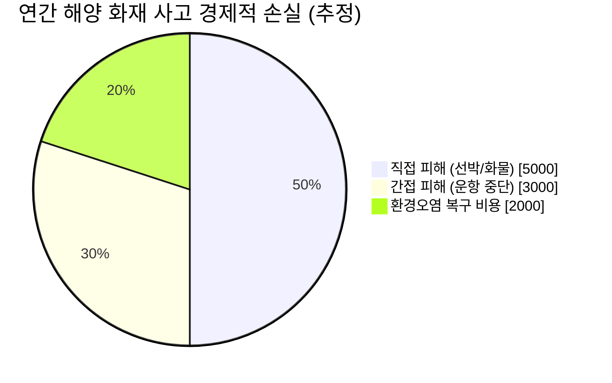

전문가들은 **연간 총 경제적 손실액을 최소 1조 원 이상**으로 추산하고 있습니다. 여기에 인명 피해로 인한 사회적 비용—유가족 지원, 심리 치료, 사회적 불안감 증가 등—은 경제적 수치로 환산할 수 없는 **무한대의 가치**를 가집니다. I-SEDSS는 이러한 피해를 사전에 예방하거나 최소화함으로써 막대한 사회적·경제적 가치를 창출할 수 있습니다.

### 1.3 정책적 필요성

#### 1.3.1 국내 정책 동향

세월호 참사 이후 대한민국 정부는 해양 안전 강화를 위한 다양한 정책과 법규를 도입해 왔습니다. 2020년 해사안전법 개정을 통해 여객선 안전관리체계가 대폭 강화되었으며, 해양수산부는 '스마트 해운물류 발전계획'을 통해 **2030년까지 자율운항선박 상용화**라는 야심찬 목표를 제시했습니다.

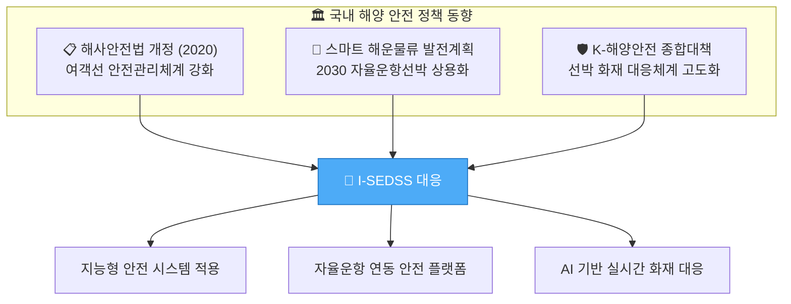

특히 'K-해양안전 종합대책'에서는 **선박 화재 예방 및 대응체계 고도화**를 핵심 과제로 설정하고, 첨단 기술을 활용한 선제적 안전관리 시스템 도입을 권장하고 있습니다. I-SEDSS는 이러한 정책 방향과 완벽하게 부합하는 기술 솔루션으로서, 정부 정책 이행의 핵심 수단이 될 수 있습니다.

#### 1.3.2 국제 규제 동향

국제적으로도 선박 안전 규제는 지속적으로 강화되는 추세입니다. **IMO SOLAS Convention**의 Chapter II-2는 선박 화재 안전에 관한 가장 권위 있는 국제 기준으로, 최근 개정을 통해 첨단 화재 감지 및 대응 시스템 도입을 촉구하고 있습니다.

유럽연합(EU)은 2025년부터 일정 규모 이상의 여객선에 **첨단 화재 감지 시스템 의무화**를 검토 중이며, 주요 선급 기관인 DNV GL과 Lloyd's Register는 '스마트십(Smart Ship)' 인증 기준에 **AI 기반 안전 시스템**을 필수 요건으로 포함시키는 방안을 논의하고 있습니다.

이러한 국제 동향은 I-SEDSS와 같은 지능형 해양 안전 시스템에 대한 **글로벌 수요가 폭발적으로 증가**할 것임을 예고합니다. 선제적으로 기술을 확보하고 국제 인증을 획득하는 것은 국가 경쟁력 확보 차원에서도 매우 중요한 과제입니다.

---

## 2. 연구개발과제의 목표 및 내용

### 1) 연구개발과제의 최종 목표

#### 핵심 목표

> **"AI 기반 실시간 화재 감지 → 동적 대피경로 생성 → 지능형 피난유도"를 통합한 선박 화재 안전 지원 시스템 개발 및 실선 실증 (TRL 7 달성)**

I-SEDSS의 핵심 철학은 **"수집(Sensing) → 분석(Analysis) → 전파(Notify) → 유도(Guidance)"**라는 4단계 가치 사슬을 단일 플랫폼으로 통합하여, 화재 발생부터 안전한 대피 완료까지의 전 과정을 **자동화·지능화**하는 것입니다.

기존 시스템에서는 각 단계가 분절되어 운영되어 병목 현상이 발생했습니다. I-SEDSS는 이 모든 단계를 **실시간으로 연결**하여, 화재 감지 후 **30초 이내에 최적 대피 경로를 생성**하고 **2분 이내에 대피를 시작**할 수 있도록 합니다.

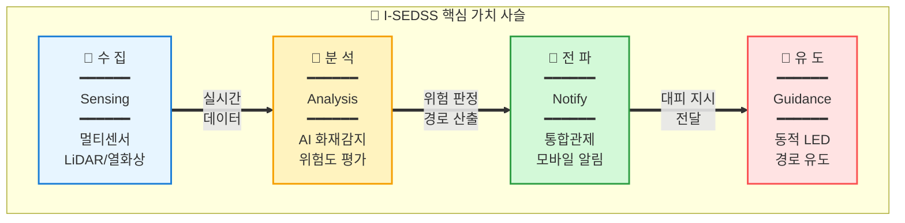

이 통합 가치 사슬은 단순히 기술적 연결에 그치지 않습니다. 각 단계에서 생성되는 데이터는 다음 단계로 즉시 전달되며, 최종 대피 결과는 다시 분석 단계로 피드백되어 **AI 모델의 지속적 학습과 개선**에 활용됩니다. 이를 통해 시스템은 운영할수록 더 정확하고 효율적인 대피 지원을 제공할 수 있게 됩니다.

#### 최종 목표 성과물

본 과제를 통해 도출할 3대 핵심 성과물은 다음과 같습니다. 각 성과물은 명확한 정량적 달성 기준을 가지며, 새동백호 실선 실증을 통해 검증됩니다.

| 구분 | 목표 | 달성 기준 |
|:---|:---|:---|
| **다중변수 대피경로 탐색 모델** | AI 기반 실시간 재탐색 S/W 시제품 | 탐색 정확도 90% 이상, 3초 이내 |
| **통합 의사결정 지원 모듈** | 중앙관제/유도등 연동 인터페이스 | 오차율 5% 미만 |
| **실시간 피난유도 시스템** | 승조원/승객 단말 연동 앱 | 실증 대피 일치율 85% 이상 |

### 2) 연구개발과제의 단계별 목표

#### 전체 로드맵 (2026-2028)

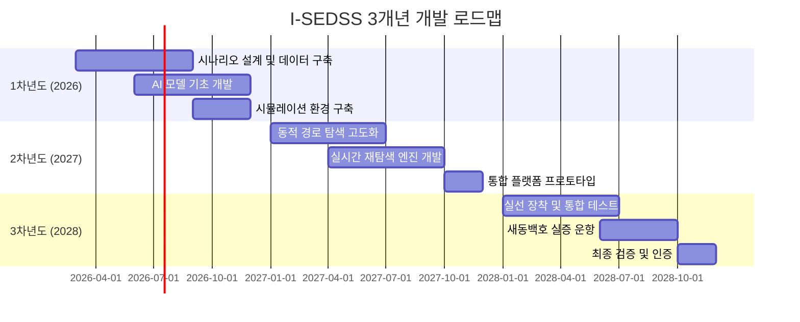

#### 연차별 상세 목표

| 연차 | 핵심 목표 | 주요 산출물 | TRL |
|:---:|:---|:---|:---:|
| **1차년도** | AI 대피경로 탐색 및 기초 시스템 구축 | 시나리오 DB, 기초 AI 모델, 시뮬레이션 환경 | TRL 4→5 |
| **2차년도** | 실시간 대피경로 재탐색 모델 고도화 | 동적 재탐색 엔진, 통합 플랫폼 프로토타입 | TRL 5→6 |
| **3차년도** | 선박 실증 및 지능형 SOP 확정 | 실선 실증 완료, 인증 획득, SOP 문서화 | TRL 6→7 |

### 3) 연구개발과제의 내용

#### 3.1 핵심 연구 내용

본 과제의 핵심 연구 내용은 화재 감지부터 안전한 대피 완료까지의 전 과정을 지능화하는 4개 핵심 모듈로 구성됩니다. 각 모듈은 독립적으로 개발되면서도, 통합 플랫폼을 통해 유기적으로 연동되어 시너지 효과를 창출합니다.

##### 3.1.1 다중변수 대피경로 탐색 모델 개발

선박 내 대피 경로 탐색은 단순한 최단 거리 계산이 아닙니다. 화재 위치, 연기 확산 방향, 각 통로의 통행 가능 여부, 승객 밀집도, 탈출구 용량 등 **수십 가지 변수를 동시에 고려**해야 합니다. 본 연구에서는 그래프 신경망(GNN)과 분산 최적화 알고리즘(DPOP)을 결합한 새로운 경로 탐색 모델을 개발합니다.

| 세부 내용 | 설명 |
|:---|:---|
| **시나리오 기반 데이터셋 구축** | 화재, 침수, 폭발 등 10개 이상 재난 시나리오 정의 및 시뮬레이션 데이터 생성 |
| **GNN/DPOP 기반 경로 탐색** | 그래프 신경망을 활용한 최적 경로 탐색 알고리즘 개발 |
| **FDS 연동 화재 확산 예측** | Fire Dynamics Simulator 연동으로 3초 단위 화재 확산 예측 |

특히 Fire Dynamics Simulator(FDS)와의 연동을 통해 화재 확산을 **3초 단위로 예측**하고, 이를 기반으로 경로를 **동적으로 재계산**하는 것이 본 모델의 핵심 차별점입니다. 5분 후 연기가 도달할 것으로 예측되는 경로는 미리 회피하여, 승객들이 안전하게 대피할 수 있도록 합니다.

##### 3.1.2 AI 화재 감지 및 센서 퓨전 기술

정확한 화재 감지는 전체 시스템의 신뢰성을 좌우하는 가장 중요한 첫 단계입니다. 단일 센서에 의존하는 기존 시스템과 달리, I-SEDSS는 **LiDAR, 열화상 카메라, 연기 감지기, CCTV** 등 이기종 센서들의 데이터를 **AI 기반으로 통합 분석**하여 오탐지율을 최소화하고 감지 정확도를 극대화합니다.

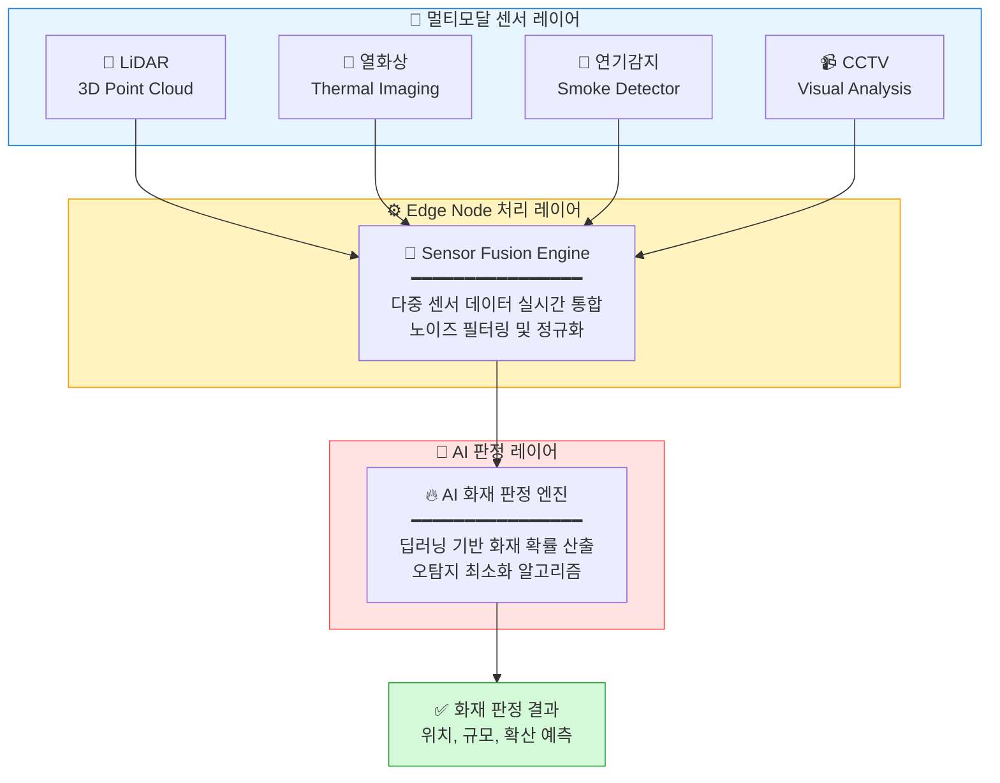

각 센서는 서로 다른 물리적 현상을 측정하기 때문에, **상호 보완적인 정보를 제공**합니다. 예를 들어 연기 감지기만으로는 조리 중 발생하는 연기와 실제 화재를 구분하기 어렵지만, 열화상 카메라의 온도 분포와 CCTV의 화염 패턴 분석을 결합하면 **99% 이상의 정확도**로 화재 여부를 판정할 수 있습니다.

##### 3.1.3 지능형 피난유도 시스템

화재가 감지되고 대피 경로가 계산되면, 이를 승객과 승조원에게 **신속하고 명확하게 전달**해야 합니다. I-SEDSS는 세 가지 채널을 통해 대피 유도 정보를 전달합니다.

| 구성요소 | 기능 | 기술 사양 |
|:---|:---|:---|
| **동적 LED 유도등** | 실시간 경로 변경에 따른 방향 지시 | RGB LED, 저조도 가시성 확보 |
| **모바일 단말 앱** | 승조원/승객 개인별 대피 경로 안내 | iOS/Android, UWB 위치추적 연동 |
| **브릿지 통합 관제** | 3D 디지털 트윈 기반 종합 상황 전시 | WebGL 기반 실시간 렌더링 |

특히 **동적 LED 유도등**은 기존의 정적 표지판을 완전히 대체하는 혁신적인 요소입니다. 화재 위치와 연기 확산에 따라 **방향이 실시간으로 변경**되어, 승객들을 항상 안전한 경로로 유도합니다. 정전 상황에서도 자체 배터리로 30분 이상 동작하도록 설계됩니다.

##### 3.1.4 설명 가능한 AI (XAI) 시스템

AI가 추천한 대피 경로를 선장과 승조원이 신뢰하고 따르려면, AI의 판단 근거를 **명확하게 설명**할 수 있어야 합니다. I-SEDSS는 설명 가능한 AI(XAI) 기술을 통해 모든 판단에 대한 **투명한 근거를 제시**합니다.

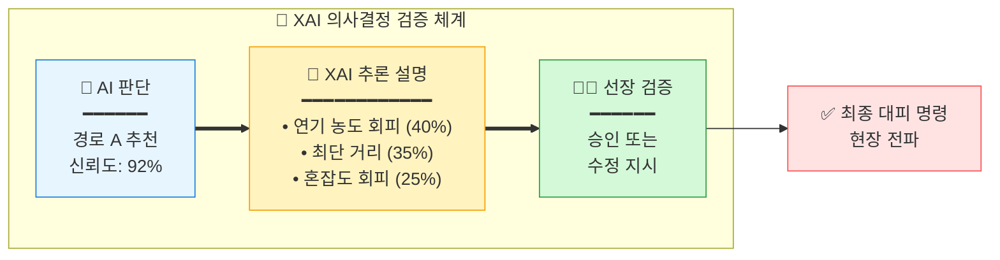

예를 들어 AI가 "경로 A를 추천합니다"라고 할 때, XAI 모듈은 "경로 A가 추천된 이유는 ① 현재 연기 농도가 낮음(40% 가중치), ② 최단 거리(35% 가중치), ③ 예상 혼잡도가 낮음(25% 가중치)입니다"라고 설명합니다. 선장은 이 설명을 바탕으로 **최종 승인 또는 수정 지시**를 내릴 수 있으며, 이는 AI에 대한 신뢰를 높이는 동시에 인간의 최종 결정권을 보장합니다.

### 4) 연구개발과제 수행일정 및 주요 결과물

#### 간트 차트 (Gantt Chart)

| 연구 내용 | 1차년도 | | | | 2차년도 | | | | 3차년도 | | | |
|:---|:---:|:---:|:---:|:---:|:---:|:---:|:---:|:---:|:---:|:---:|:---:|:---:|
| | Q1 | Q2 | Q3 | Q4 | Q1 | Q2 | Q3 | Q4 | Q1 | Q2 | Q3 | Q4 |
| 시나리오 설계 | ██ | ██ | | | | | | | | | | |
| 데이터셋 구축 | | ██ | ██ | ██ | | | | | | | | |
| AI 모델 개발 | | | ██ | ██ | ██ | ██ | | | | | | |
| 시뮬레이션 환경 | | | | ██ | ██ | | | | | | | |
| 동적 재탐색 엔진 | | | | | ██ | ██ | ██ | | | | | |
| 통합 플랫폼 개발 | | | | | | ██ | ██ | ██ | | | | |
| 하드웨어 설치 | | | | | | | | ██ | ██ | | | |
| 실선 통합 테스트 | | | | | | | | | ██ | ██ | ██ | |
| 최종 검증/인증 | | | | | | | | | | | ██ | ██ |

#### 연차별 주요 결과물

| 연차 | 결과물 | 유형 | 비고 |
|:---:|:---|:---:|:---|
| 1차년도 | 재난 시나리오 데이터셋 (10종 이상) | DB | PyroSim/Pathfinder 데이터 |
| 1차년도 | 기초 AI 대피경로 탐색 모델 v1.0 | S/W | Python/TensorFlow |
| 2차년도 | 실시간 재탐색 엔진 v2.0 | S/W | Edge 최적화 버전 |
| 2차년도 | 통합 관제 플랫폼 프로토타입 | S/W | Web 기반 |
| 3차년도 | 새동백호 실증 보고서 | 문서 | 성능 검증 결과 |
| 3차년도 | 지능형 SOP 매뉴얼 | 문서 | 표준 운영 절차 |

---

## 3. 연구개발과제의 추진전략·방법 및 추진체계

### 1) 연구개발과제의 추진전략⋅방법

#### 3.1.1 핵심 추진 전략

I-SEDSS 개발의 성공을 위해 4대 핵심 전략 기술을 중심으로 연구개발을 추진합니다. 각 전략은 기존 시스템의 한계를 극복하고 차별화된 가치를 창출하기 위해 설정되었습니다.

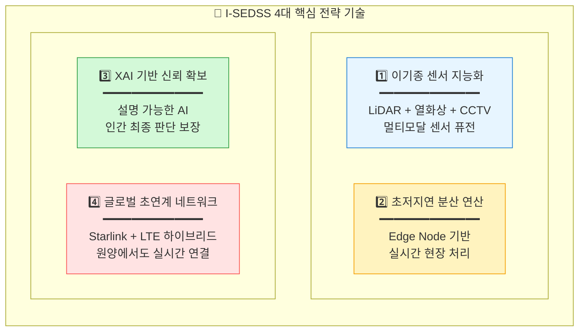

**첫째, 이기종 센서 지능화**는 LiDAR, 열화상 카메라, CCTV 등 서로 다른 특성의 센서 데이터를 AI 기반으로 통합 분석하여, 단일 센서로는 불가능한 정확하고 신뢰성 있는 화재 감지를 가능하게 합니다.

**둘째, 초저지연 분산 연산**은 클라우드 의존 없이 선박 내 Edge Node에서 실시간 데이터 처리를 수행하여, 통신 지연이나 두절 상황에서도 시스템이 독립적으로 동작할 수 있도록 합니다.

**셋째, XAI 기반 신뢰 확보**는 AI의 모든 판단에 대해 명확한 근거를 제시하여, 선장과 승조원이 AI 권고를 신뢰하고 따를 수 있도록 하면서도 인간의 최종 결정권을 보장합니다.

**넷째, 글로벌 초연계 네트워크**는 Starlink 위성통신과 LTE를 하이브리드로 활용하여, 원양 항해 중에도 육상 관제센터 및 해경과의 실시간 데이터 교환을 가능하게 합니다.

#### 3.1.2 기술 개발 방법론

본 과제는 국제해사기구(IMO)의 가이드라인을 철저히 준수하면서, 최신 AI 기술과 디지털 트윈 시뮬레이션을 결합한 체계적인 방법론을 적용합니다.

| 단계 | 방법 | 도구/플랫폼 |
|:---|:---|:---|
| **시나리오 설계** | IMO MSC.1/Circ.1238 가이드라인 준수 | PyroSim, Pathfinder |
| **데이터 생성** | FDS 기반 Synthetic Data 생성 | Fire Dynamics Simulator |
| **AI 모델 개발** | GNN, Transformer 기반 경로 탐색 | PyTorch, TensorFlow |
| **시뮬레이션** | 디지털 트윈 연동 성능 검증 | Unity, Unreal Engine |
| **실증** | 새동백호 실선 장착 및 해상 테스트 | 실선 운항 환경 |

특히 IMO MSC.1/Circ.1238은 신조 및 현존 여객선의 대피 분석에 관한 국제 표준 가이드라인으로, I-SEDSS의 시나리오 설계와 성능 평가의 기준으로 활용됩니다. 이를 통해 개발된 시스템이 국제적으로 인정받을 수 있는 기반을 마련합니다.

#### 3.1.3 리스크 관리 전략

해상 환경은 예측 불가능한 상황이 빈번히 발생하므로, 시스템의 **장애 허용성(Fault Tolerance)**은 매우 중요합니다. I-SEDSS는 발생 가능한 주요 리스크에 대해 사전에 완화 전략과 대응 방안을 수립합니다.

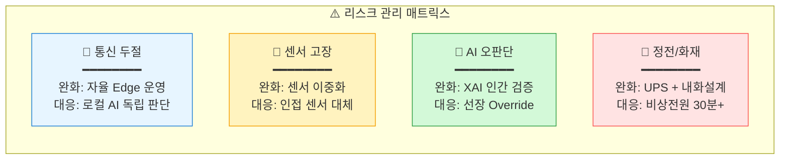

특히 **통신 두절** 상황에 대한 대응이 핵심입니다. 원양 항해 중 위성 통신이 끊어지더라도, 각 Edge Node가 독립적으로 AI 판단을 수행하고 대피 유도를 계속할 수 있도록 설계됩니다. 이는 I-SEDSS가 진정한 의미의 **자율적 안전 시스템**으로 기능할 수 있게 하는 핵심 요소입니다.

### 2) 연구개발과제의 추진체계

#### 3.2.1 컨소시엄 구성도

본 과제는 주관기관 (주)오든을 중심으로, AI 핵심 기술, 선박 인프라, 학술 연구, 인증 시험 분야의 최고 전문 기관들이 참여하는 **5개 기관 컨소시엄**으로 구성됩니다. 각 기관은 고유한 강점을 바탕으로 유기적으로 협력하여 시스템을 완성합니다.

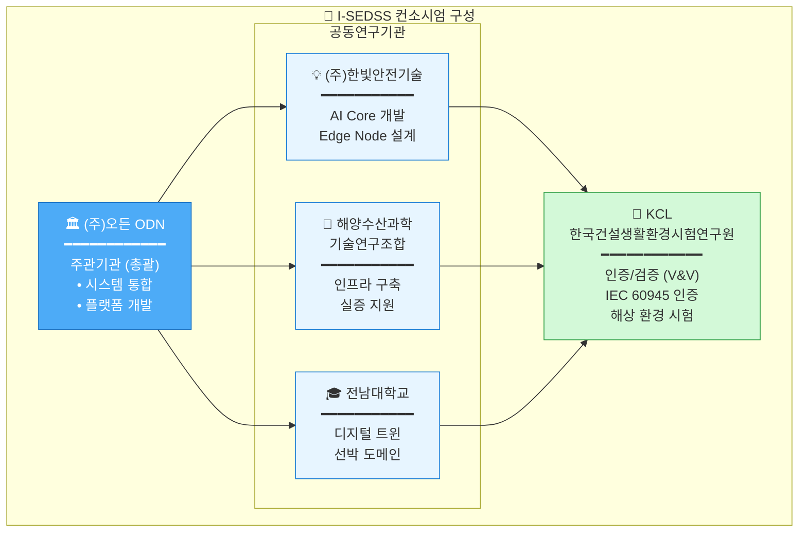

#### 3.2.2 기관별 역할 분담

| 기관 | 역할 | 주요 담당 업무 |
|:---|:---:|:---|
| **(주)오든** | 주관 | 총괄 PM, 시스템 통합, 플랫폼 개발, 실증 총괄 |
| **(주)한빛안전기술** | 공동 | AI 엔진 개발, Edge Node 설계, 센서 퓨전 알고리즘 |
| **해양수산과학기술연구조합** | 공동 | 실증 선박 인프라 구축, 통신 네트워크, 현장 지원 |
| **전남대학교** | 공동 | 디지털 트윈 개발, 선박 구조 모델링, 시뮬레이션 |
| **KCL** | 공동 | 인증 시험, 해상 환경 검증, V&V 프로세스 |

#### 3.2.3 실증 선박: 새동백호

| 항목 | 사양 |
|:---|:---|
| **선명** | 새동백호 (Sae-Dongbaek) |
| **선종** | 카페리 (Car Ferry) |
| **총톤수** | 약 10,000 GT |
| **운항 노선** | 목포 ↔ 제주 |
| **실증 내용** | 전 구역 센서 설치, 통합 관제 시스템 운영 |

---

## 4. 연구개발성과의 활용방안 및 기대효과

### 1) 연구개발성과의 활용방안

#### 4.1.1 단계별 활용 계획

I-SEDSS의 기술은 새동백호 실증을 시작으로 점진적으로 적용 범위를 확대해 나가는 전략을 취합니다. 국내 시장에서 기술을 검증하고 안정화한 후, 글로벌 시장으로 진출하여 세계 해양 안전 시장의 선도 기업으로 도약합니다.

| 단계 | 기간 | 활용 방안 |
|:---|:---:|:---|
| **1단계** | 2026-2028 | 새동백호 실증을 통한 기술 검증 및 고도화 |
| **2단계** | 2029-2030 | 국내 여객선 우선 적용 확대 (30척 목표) |
| **3단계** | 2031~ | 글로벌 시장 진출 (크루즈, 화물선 등) |

#### 4.1.2 주요 활용 분야

I-SEDSS 기술은 여객선을 시작으로, 크루즈선, 화물선, 그리고 궁극적으로 **자율운항선박(MASS)**까지 그 적용 범위를 확장할 수 있습니다. 특히 자율운항선박에서는 승조원이 없거나 최소화되기 때문에, AI 기반 자동 안전 시스템은 **필수적인 핵심 기술**이 됩니다.

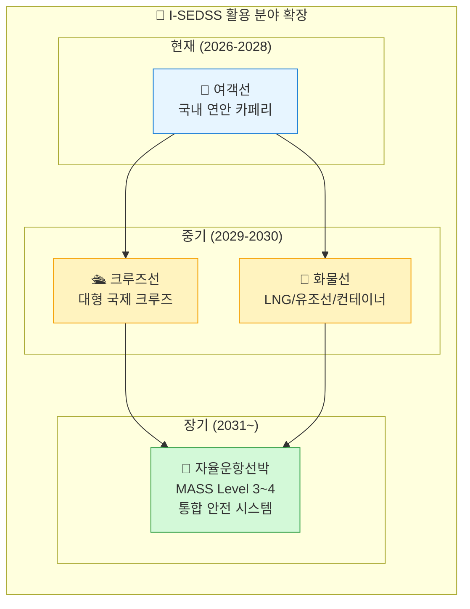

자율운항선박 시장은 2030년까지 급성장이 예상되며, 대한민국 정부도 이 분야에서 글로벌 선도국이 되겠다는 목표를 가지고 있습니다. I-SEDSS는 자율운항선박에 **반드시 탑재되어야 하는 핵심 안전 인프라**로서, 관련 시장 성장과 함께 폭발적인 수요 증가가 예상됩니다.

#### 4.1.3 기술 이전 및 라이선싱

본 과제를 통해 개발된 핵심 기술들은 다양한 형태로 산업계에 이전되어 활용될 수 있습니다. 각 기술 모듈은 독립적으로 라이선싱이 가능하도록 설계되어, 조선소, 해운사, 해양 안전 기업 등에 맞춤형 솔루션을 제공할 수 있습니다.

| 기술 항목 | 이전 대상 | 예상 시기 |
|:---|:---|:---:|
| AI 화재 감지 알고리즘 | 국내 조선소, 해운사 | 2029년 |
| 동적 경로 탐색 엔진 | 글로벌 해양 안전 기업 | 2030년 |
| 통합 관제 플랫폼 | 선급/인증기관 | 2030년 |

### 2) 연구개발성과의 기대효과

#### 4.2.1 정량적 기대효과

I-SEDSS 도입을 통한 가장 핵심적인 개선 효과는 **골든타임 확보**입니다. 화재 감지부터 대피 시작까지의 시간을 획기적으로 단축하여, 승객과 승조원이 안전하게 대피할 수 있는 시간을 확보합니다.

| 지표 | 현재 (As-Is) | 목표 (To-Be) | 개선율 |
|:---|:---:|:---:|:---:|
| **화재 감지 시간** | 10분 이상 | 30초 이내 | **95% 단축** |
| **대피 시작 시간** | 15분 | 2분 | **87% 단축** |
| **대피 완료 시간** | 40분 | 15분 | **63% 단축** |
| **골든타임 확보율** | 30% | 90% | **200% 향상** |

아래 다이어그램은 기존 시스템과 I-SEDSS의 대응 시간을 비교한 것입니다. 기존 시스템에서 30분 이상 소요되던 대피 시작이, I-SEDSS에서는 **단 2분 이내**에 가능해집니다.

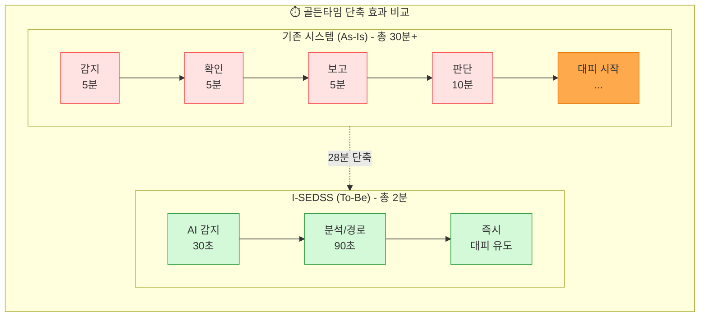

이러한 시간 단축은 단순한 수치가 아닙니다. 선박 화재에서 **5분의 차이가 생사를 가르는** 상황에서, 28분이라는 시간 단축은 **수백 명의 생명을 구할 수 있는** 결정적인 차이입니다.

#### 4.2.2 정성적 기대효과

정량적 효과 외에도 I-SEDSS는 다양한 정성적 가치를 창출합니다. 인명 안전 확보라는 본질적 가치와 함께, 해양 안전 분야의 기술 자립, 산업 경쟁력 강화, 그리고 해운 산업에 대한 국민의 신뢰 회복까지 다층적인 효과가 기대됩니다.

| 구분 | 기대효과 |
|:---|:---|
| **인명 안전** | 선박 화재 시 인명피해 최소화, 골든타임 내 대피 완료 |
| **기술 자립** | 해양 안전 분야 국산 AI 기술 확보 |
| **산업 경쟁력** | 스마트십/자율운항선박 시장 선점 |
| **사회적 신뢰** | 해운 산업에 대한 국민 안전 신뢰 회복 |

특히 **사회적 신뢰 회복**은 매우 중요한 가치입니다. 세월호 참사 이후 대한민국 국민들 사이에 형성된 해상 교통에 대한 불안감은 아직도 남아 있습니다. I-SEDSS와 같은 첨단 안전 시스템의 도입은 "다시는 그런 비극이 발생하지 않을 것"이라는 확신을 국민들에게 심어줄 수 있습니다.

#### 4.2.3 경제적 파급효과

I-SEDSS의 경제적 파급효과는 직접 매출, 해외 수출, 유지보수 서비스, 그리고 피해 예방에 따른 비용 절감까지 다각도로 발생합니다.

| 항목 | 산출 근거 | 예상 효과 |
|:---|:---|---:|
| **직접 매출** | 국내 30척 × 5억원 | 150억 원 |
| **해외 수출** | 글로벌 100척 × 7억원 | 700억 원 |
| **유지보수** | 연간 구독형 서비스 | 50억 원/년 |
| **피해 예방** | 사고 1건당 100억 원 절감 | 300억 원/년 |

---

## 5. 연구개발성과의 사업화 전략 및 계획

### 1) 국내외 시장 동향

#### 5.1.1 글로벌 스마트십 시장

글로벌 스마트 해운·조선 시장은 디지털화와 자율운항 기술의 발전에 힘입어 **폭발적인 성장**이 예상됩니다. 선박의 안전, 효율, 환경 성능을 향상시키기 위한 첨단 기술 투자가 전 세계적으로 확대되고 있으며, 특히 화재를 포함한 안전 분야는 가장 기본적이면서도 중요한 투자 대상입니다.

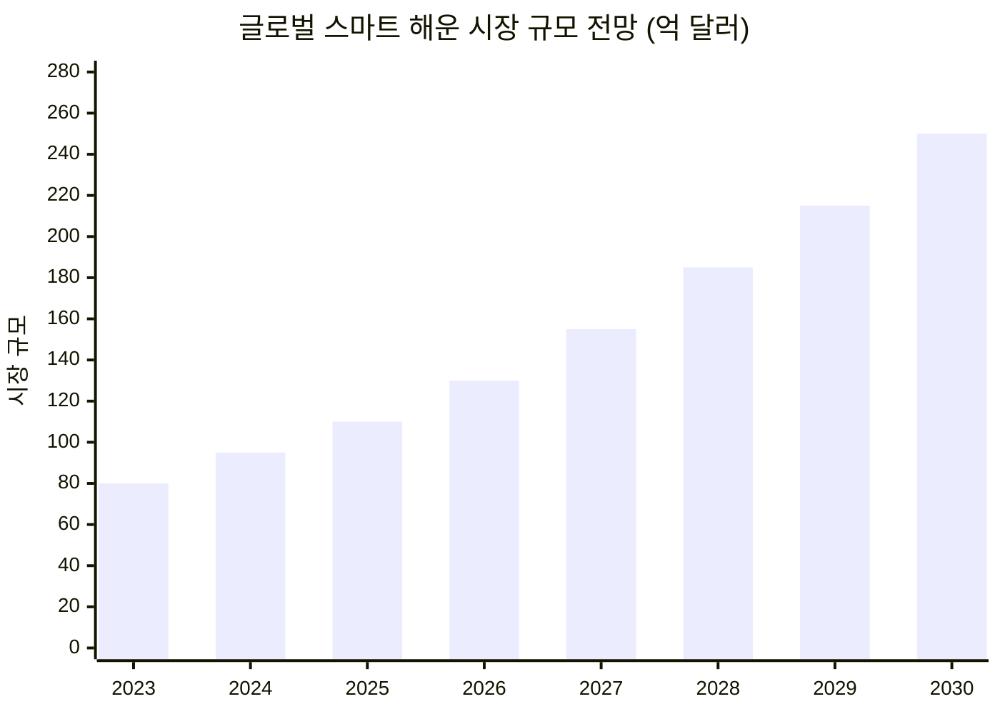

시장 조사 기관들의 분석에 따르면, 글로벌 스마트 해운 시장은 **연평균 12.5%(CAGR)**의 성장률을 기록하며, 2030년에는 **약 250억 달러(약 32조 원)** 규모에 도달할 것으로 전망됩니다. 이 중 안전 관련 시스템은 전체 시장의 약 15~20%를 차지하여, I-SEDSS가 목표로 하는 시장만 해도 **5조 원 이상**의 거대한 기회가 존재합니다.

#### 5.1.2 경쟁사 현황 분석

현재 해양 안전 및 스마트십 분야의 글로벌 선두 기업들은 대부분 유럽에 본사를 두고 있습니다. 그러나 이들 기업은 주로 항해, 추진, 전력 관리 분야에 집중하고 있으며, **화재 감지 및 대피 유도 분야에서는 상대적으로 기술 개발이 미흡**합니다.

| 경쟁사 | 국가 | 주요 기술 | I-SEDSS 대비 차별점 |
|:---|:---:|:---|:---|
| Kongsberg | 노르웨이 | 자율운항 통합 시스템 | 화재 대응 특화 부족 |
| Wärtsilä | 핀란드 | 항해 최적화 솔루션 | AI 피난유도 기능 無 |
| ABB Marine | 스위스 | 추진/전력 관리 | 안전 시스템 별도 구성 |
| **I-SEDSS** | **한국** | **AI 화재 감지 + 동적 대피** | **End-to-End 통합** |

I-SEDSS의 가장 큰 차별점은 화재 감지부터 대피 완료까지의 **전 과정을 하나의 통합 플랫폼**으로 제공한다는 것입니다. 기존 경쟁사들의 솔루션은 감지, 관제, 유도 시스템이 각각 별개의 제품으로 제공되어 통합 운영이 어려웠던 반면, I-SEDSS는 처음부터 **End-to-End 통합 설계**를 기본으로 합니다.

### 2) 지식재산권, 표준화 및 인증기준 현황

#### 5.2.1 특허 확보 전략

핵심 기술에 대한 지식재산권 확보는 사업화 성공의 필수 조건입니다. 본 과제에서는 4건의 핵심 특허를 출원하여, **기술적 해자(Moat)**를 구축합니다. 특허는 국내뿐 아니라 PCT, 미국, EU 등 주요 시장에도 권리를 확보하여 글로벌 사업화에 대비합니다.

| 순번 | 특허명 (예정) | 출원 시기 | 권리범위 |
|:---:|:---|:---:|:---|
| 1 | AI 기반 선박 화재 실시간 감지 방법 및 장치 | 2026 Q2 | 한국, PCT |
| 2 | 동적 대피경로 재탐색 알고리즘 | 2027 Q1 | 한국, 미국, EU |
| 3 | XAI 기반 해상 의사결정 지원 시스템 | 2027 Q3 | 한국, PCT |
| 4 | 멀티모달 센서 퓨전 화재 검출 방법 | 2028 Q1 | 한국, 미국 |

#### 5.2.2 인증 현황 및 계획

선박용 장비는 국제 규격 인증 없이는 실제 선박에 탑재할 수 없습니다. 본 과제에서는 KCL과의 협력을 통해 IEC, SOLAS, ISO 등 필수 인증을 체계적으로 획득합니다.

| 인증/규격 | 내용 | 취득 계획 |
|:---|:---|:---:|
| **IEC 60945** | 해상 항해 장비 일반 요구사항 | 2028년 |
| **SOLAS II-2** | 선박 화재 안전 국제협약 | 2028년 |
| **ISO 19847** | 선박 데이터 표준 | 2028년 |
| **선급 인증** | KR, DNV, Lloyd's | 2029년 |

### 3) 표준화 전략

#### 5.3.1 표준화 추진 계획

기술 리더십 확보를 넘어, **표준화 주도권**을 확보하는 것이 장기적 경쟁력의 핵심입니다. 본 과제에서 개발된 기술을 국내 표준(KS)에서 시작하여 점진적으로 국제 표준(ISO, IEC)으로 확산시키는 전략을 추진합니다.

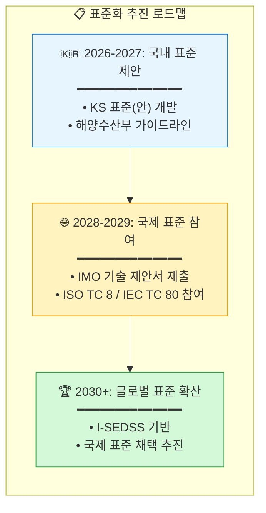

I-SEDSS 기반 기술이 국제 표준으로 채택되면, 해당 표준을 준수하는 모든 선박에서 I-SEDSS 또는 호환 시스템을 채택해야 하므로, **막대한 시장 선점 효과**를 기대할 수 있습니다.

### 4) 사업화 계획

#### 5.4.1 사업화 일정

I-SEDSS의 사업화는 R&D 과제 종료 후 바로 시작할 수 있도록, 과제 수행 기간 중 사업화 준비를 병행합니다. 인증 획득, 양산 설계, 파트너십 구축 등을 미리 진행하여, 2029년부터 본격적인 상용화에 돌입합니다.

| 단계 | 기간 | 주요 활동 |
|:---|:---:|:---|
| **기술 완성** | 2026-2028 | R&D 과제 수행, 실선 실증 완료 |
| **사업화 준비** | 2028-2029 | 인증 취득, 양산 설계, 파트너십 구축 |
| **국내 사업화** | 2029-2030 | 국내 여객선 30척 공급 목표 |
| **글로벌 진출** | 2030~ | 아시아, 유럽, 북미 시장 진출 |

#### 5.4.2 수익 모델

I-SEDSS의 수익 모델은 초기 설치 수익과 지속적인 서비스 수익을 균형 있게 구성합니다. 하드웨어 판매와 소프트웨어 라이선스를 통한 **초기 매출**과 함께, 연간 유지보수 구독 서비스를 통해 **안정적인 반복 수익(Recurring Revenue)**을 확보합니다.

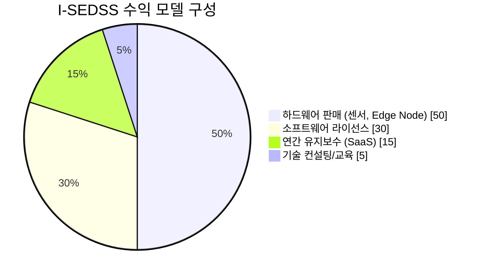

특히 SaaS 기반의 연간 유지보수 모델은 AI 모델의 지속적인 업데이트, 새로운 시나리오 추가, 성능 개선 등을 포함하여, 고객에게 지속적인 가치를 제공하면서 안정적인 수익 흐름을 창출합니다.

#### 5.4.3 매출 전망

보수적인 추정을 기준으로, I-SEDSS는 2033년까지 국내외 합계 **연간 850억 원** 이상의 매출을 달성할 것으로 전망됩니다. 글로벌 시장 진출이 본격화되는 2031년 이후 해외 매출이 급증하는 구조입니다.

| 연도 | 국내 | 해외 | 합계 (억원) |
|:---:|---:|---:|---:|
| 2029 | 50 | 0 | 50 |
| 2030 | 100 | 50 | 150 |
| 2031 | 150 | 200 | 350 |
| 2032 | 200 | 400 | 600 |
| 2033 | 250 | 600 | 850 |

---

## 6. 평가기준 및 평가방법

### 1) 성과지표 및 목표치

#### 6.1.1 정량적 성과지표

| 구분 | 성과지표 | 목표치 | 가중치 |
|:---|:---|:---:|:---:|
| **특허 출원** | 국내외 특허 출원 건수 | 4건 | 10% |
| **특허 등록** | 국내외 특허 등록 건수 | 2건 | 15% |
| **S/W 등록** | 소프트웨어 저작권 등록 | 4건 | 10% |
| **시제품 (TRL 7)** | 실선 실증 시스템 | 1식 | 20% |
| **시제품 (TRL 6)** | 통합 플랫폼 프로토타입 | 1식 | 15% |
| **논문 게재** | SCI급 학술지 게재 | 3편 | 10% |
| **인력 양성** | 석박사 배출 | 4명 | 10% |
| **만족도 조사** | 전문가/현장 평가 | 90점 이상 | 10% |

#### 6.1.2 정성적 성과 목표

| 구분 | 목표 내용 |
|:---|:---|
| **기술 완성도** | TRL 7 수준의 실선 적용 가능한 시스템 완성 |
| **현장 적합성** | 새동백호 실증을 통한 실사용 환경 검증 |
| **확장 가능성** | 다양한 선종 및 글로벌 시장 적용 가능한 설계 |
| **안전성 검증** | IEC/SOLAS 규격 적합성 인증 |

### 2) 성능지표 및 측정방법

#### 6.2.1 핵심 성능지표 (KPI)

본 과제의 성공적 수행 여부를 객관적으로 평가하기 위해 10개의 핵심 성능지표(KPI)를 설정합니다. 각 지표는 명확한 측정 방법과 목표치를 가지며, 시뮬레이션 검증과 실선 실증을 통해 달성 여부를 확인합니다.

| 순번 | 성능지표 | 단위 | 목표치 | 측정방법 |
|:---:|:---|:---:|:---:|:---|
| 1 | 시나리오 타당성 | 점 | 90 이상 | PHA 기반 위험성 평가 |
| 2 | 경로 탐색/재탐색 정확도 | % | 90 이상 | 시뮬레이션 비교 검증 |
| 3 | 의사결정 추론 정확성 | 점 | 80 이상 | BLR/GLM 결정 오차율 분석 |
| 4 | 도면 인식 정확도 | F1 | 0.9 이상 | Faster R-CNN 평가 |
| 5 | 밀집도 추정 오차 | MAE | 5% 이하 | LiDAR 데이터 검증 |
| 6 | 실증 대피 일치율 | % | 85 이상 | 실선 훈련 결과 비교 |
| 7 | 외부 정보 연계 | 종 | 2 이상 | API 연동 확인 |
| 8 | 데이터 응답 지연 | 초 | 5 이하 | NTP 동기화 측정 |
| 9 | 실증 시나리오 건수 | 건 | 3 이상 | 실선 훈련 횟수 |
| 10 | 전문가 만족도 | 점 | 80 이상 | Likert 5점 척도 설문 |

특히 **경로 탐색 정확도 90% 이상**, **시스템 응답 지연 5초 이하**, **실증 대피 일치율 85% 이상**은 I-SEDSS의 핵심 가치인 **신속하고 정확한 대피 유도**를 직접적으로 검증하는 지표입니다.

#### 6.2.2 검증 환경 및 도구

각 성능지표는 전문적인 검증 환경과 도구를 통해 객관적으로 측정됩니다. 특히 디지털 트윈 환경과 실선 실증 환경을 병행하여, 시뮬레이션 결과와 실제 운영 결과의 일치성을 검증합니다.

| 성능지표 | 검증 환경 | 검증 도구 |
|:---|:---|:---|
| 시나리오 타당성 | 새동백호 BIM 모델 | Pathfinder, PyroSim |
| 경로 탐색 정확도 | 디지털 트윈 환경 | Unity, FDS 연동 |
| 의사결정 정확성 | 선박 브릿지 시뮬레이터 | 시나리오 20회 반복 |
| 도면 인식 | GA 도면 400+ 데이터셋 | Faster R-CNN, SAM |
| 밀집도 추정 | LiDAR 실측 데이터 | ShanghaiTech 벤치마크 |
| 실증 대피 일치율 | 새동백호 실선 | UWB 위치추적, VR 훈련 |
| 시스템 응답 지연 | 고부하 시나리오 | JMeter, NTP 동기화 |
| 전문가 만족도 | 선장/해기사 30명 | 온라인 설문 |

#### 6.2.3 단계별 검증 계획

검증은 연차별로 **기초 검증 → 통합 검증 → 실증 검증**의 3단계 체계로 진행됩니다. 각 단계에서 발견된 문제는 즉시 개발팀에 피드백되어, 지속적인 개선 사이클을 형성합니다.

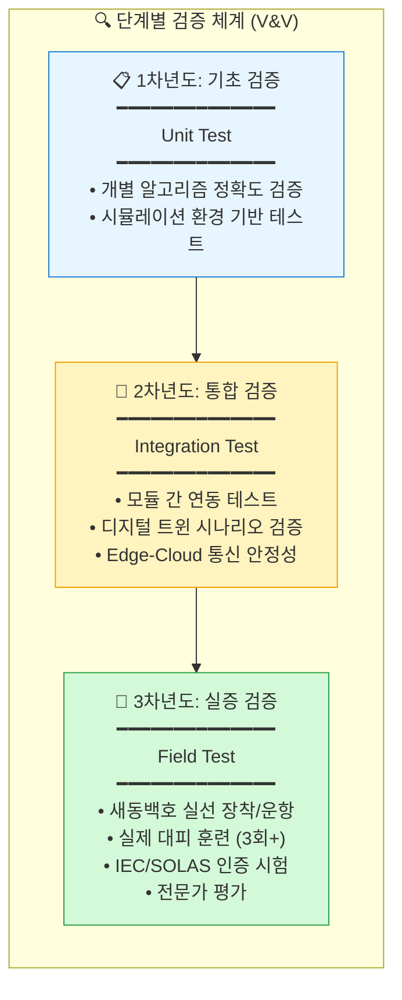

3차년도의 **실증 검증**은 본 과제의 가장 핵심적인 검증 단계입니다. 새동백호에서 진행되는 3회 이상의 실제 대피 훈련을 통해, 시스템의 실전 적용 가능성을 최종 확인합니다. 이 과정에서 IEC 60945 및 SOLAS II-2 인증을 위한 시험도 병행합니다.

---

## 부록

### A. 용어 정의

| 용어 | 정의 |
|:---|:---|
| **I-SEDSS** | Intelligent Ship Evacuation & Decision Support System |
| **TRL** | Technology Readiness Level (기술 성숙도) |
| **FDS** | Fire Dynamics Simulator (화재 동역학 시뮬레이터) |
| **GNN** | Graph Neural Network (그래프 신경망) |
| **XAI** | Explainable Artificial Intelligence (설명 가능한 AI) |
| **SOLAS** | Safety of Life at Sea (해상 인명 안전 협약) |
| **IMO** | International Maritime Organization (국제해사기구) |
| **MASS** | Maritime Autonomous Surface Ships (자율운항선박) |

### B. 참고문헌

1. IMO MSC.1/Circ.1238 - Guidelines for Evacuation Analysis for New and Existing Passenger Ships
2. SOLAS Chapter II-2 - Construction – Fire Protection, Fire Detection and Fire Extinction
3. IEC 60945 - Maritime Navigation and Radiocommunication Equipment and Systems
4. ISO 19847 - Ships and Marine Technology – Shipboard Data Servers to Share Field Data at Sea

---

> **문서 작성일**: 2026년 2월  
> **버전**: v1.0  
> **작성 기관**: (주)오든 (ODN)
