# I-SEDSS 사업계획서
## 지능형 선박 복합 재난 피난 유도 및 의사결정 지원 시스템

> **과제명**: 지능형 선박 복합 재난 안전 지원 시스템 (I-SEDSS: Intelligent Ship Evacuation & Decision Support System)  
> **주관기관**: (주)오든 (ODN)  
> **공동연구기관**: (주)한빛안전기술, 해양수산과학기술연구조합, 전남대학교, 한국건설생활환경시험연구원(KCL)  
> **연구기간**: 2026년 ~ 2028년 (3개년)

---

## 목차

1. [연구개발과제의 필요성](#1-연구개발과제의-필요성)
2. [연구개발과제의 목표 및 내용](#2-연구개발과제의-목표-및-내용)
3. [연구개발과제의 추진전략·방법 및 추진체계](#3-연구개발과제의-추진전략방법-및-추진체계)
4. [연구개발성과의 활용방안 및 기대효과](#4-연구개발성과의-활용방안-및-기대효과)
5. [연구개발성과의 사업화 전략 및 계획](#5-연구개발성과의-사업화-전략-및-계획)
6. [평가기준 및 평가방법](#6-평가기준-및-평가방법)
7. [기술 사양 및 협의 필요 사항](#7-기술-사양-및-협의-필요-사항)

---

## 1. 연구개발과제의 필요성

### 1.1 기술적 필요성

#### 1.1.1 선박 재난 대응의 구조적 한계

선박 환경에서의 재난(화재, 좌초, 충돌 등)은 육상과는 본질적으로 다른 특수한 도전 과제를 안고 있습니다. 선박은 본질적으로 **"폐쇄된 강철 미로"**이자 **"스스로 고립된 공간"**이라는 구조적 특성을 가지고 있어, 일반 재난 대비 **대응 난이도가 10배 이상** 높은 것으로 분석됩니다.

특히 복합 재난 발생 시, 선체 경사와 침수 등으로 인해 가동 가능한 장비가 제한되고 연기와 열이 빠르게 확산되면서 대피 경로가 순식간에 차단될 수 있습니다.

| 구분 | 현황 | 문제점 |
|:---:|:---|:---|
| **초동 대응** | 사고 인지 후 대응 시작까지 평균 30분 지연 | 골든타임 소실로 대형 인명피해 야기 |
| **데이터 블라인드** | 선내 사각지대 및 센서 파손 시 현황 파악 불가 | 고립자 위치 및 선체 손상 부위 파악 지연 |
| **대피 경로 경직성** | 상황 변화(침수, 화재) 미반영 고정 표지판 | 패닉 상태 승객의 위험 구역(침수/화염) 유입 |

현재 선박 안전 시스템의 가장 큰 문제는 **"인지 → 확인 → 보고 → 판단"**이라는 순차적 과정에서 발생하는 병목 현상입니다. 아래 다이어그램은 기존 시스템의 대응 흐름과 그 한계를 보여줍니다.

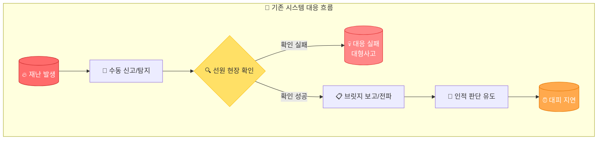

이 과정에서 각 단계마다 5~10분의 지연이 발생하며, 결과적으로 **화재 발생 후 실제 대피가 시작되기까지 30분 이상**이 소요되는 것이 현실입니다. 이는 선박 화재에서 가장 중요한 **"골든타임(Golden Time)"**을 완전히 소실시키는 치명적인 구조적 문제입니다.

#### 1.1.2 기존 시스템의 5대 한계점

현재 선박에 탑재된 안전 시스템들은 대부분 1990년대~2000년대 초반에 설계된 기술에 기반하고 있습니다. 이들 시스템은 개별적으로는 일정 수준의 기능을 수행하지만, **통합적인 재난 대응**이라는 관점에서는 심각한 한계를 보이고 있습니다.

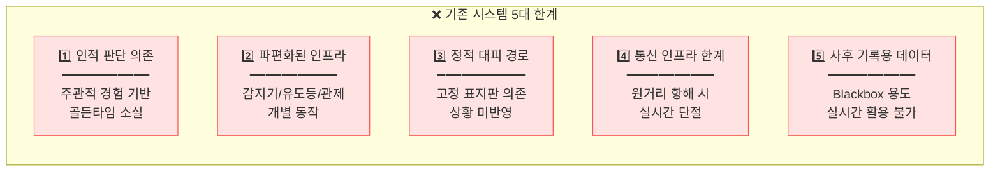

**첫째**, 현재 시스템은 **인적 판단과 경험에 과도하게 의존**하고 있습니다. 화재 발생 시 연기 감지기가 작동하더라도, 실제 화재 여부 확인과 대응 결정은 전적으로 승조원의 경험과 판단에 맡겨집니다. 야간이나 악천후 시, 경험이 부족한 승조원이 당직인 경우 초동 대응이 크게 지연될 수 있습니다.

**둘째**, 선박 내 안전 장비들이 **분절된 파편화 인프라**로 운영되고 있습니다. 연기 감지기, 스프링클러, 비상 유도등, CCTV, 방송 시스템 등이 각각 독립적으로 동작하여, 재난 상황을 종합적으로 인지하고 대응하는 것이 불가능합니다.

**셋째**, 대피 경로 안내가 **고정된 정적 시스템**에 의존합니다. 벽면에 부착된 비상구 표지판과 유도등은 화재 위치나 연기 확산 방향을 전혀 고려하지 못합니다. 패닉 상태의 승객들이 표지판만 보고 오히려 화재 방향으로 이동하는 2차 피해가 빈번히 발생합니다.

**넷째**, **해상 통신 인프라의 본질적 한계**가 있습니다. 연안이 아닌 원양 항해 중에는 육상 관제센터나 해경과의 실시간 데이터 교환이 사실상 불가능합니다. 위성 통신이 가능하더라도 대역폭 제한으로 영상이나 대용량 센서 데이터 전송은 어렵습니다.

**다섯째**, 현재 수집되는 데이터는 대부분 **사후 기록용(Blackbox)**으로만 활용됩니다. VDR(Voyage Data Recorder)에 저장된 정보는 사고 후 원인 규명에는 활용되지만, 실시간 대응에는 전혀 기여하지 못하는 "쓰고 버리는" 구조입니다.

### 1.2 사회·경제적 필요성

#### 1.2.1 해양 사고 피해 현황과 교훈

대한민국은 2014년 세월호 참사라는 뼈아픈 경험을 통해 해상 안전의 중요성을 처절하게 깨달았습니다. **304명의 소중한 생명**이 희생된 이 사고는 단순한 침몰 사고가 아니라, **초기 상황 판단의 오류와 지연된 대피 지시**가 피해를 기하급수적으로 확대시킨 대표적인 복합 재난 사례입니다.

사고 당시 승객들에게 "가만히 있으라"는 방송이 나간 것은 선박의 경사도, 침수 진행 상황, 최적 대피 경로 등에 대한 **정확한 데이터 기반 의사결정 지원 체계가 부재**했기 때문입니다. 만약 AI가 실시간으로 선체 상태를 분석하여 최적의 탈출 시점과 경로를 산출했다면 훨씬 많은 생명을 구할 수 있었을 것입니다.

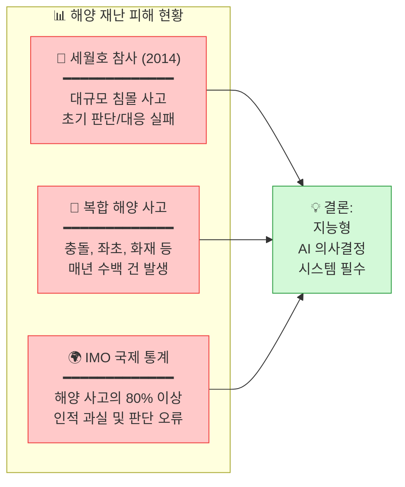

국내에서는 연평균 2,500건 이상의 해양 사고가 발생하고 있으며, 이 중 인명 피해로 직결되는 중대 사고(화재, 침몰, 충돌)의 비중이 높습니다. 국제해사기구(IMO) 통계에 따르면 해양 사고의 80% 이상이 부적절한 상황 판단이나 대피 지연 등 인적 과실(Human Error)에 의해 발생합니다.

#### 1.2.2 경제적 손실 규모

해양 재난으로 인한 경제적 손실은 선박과 화물의 손실을 넘어 천문학적인 사회적 비용을 발생시킵니다.

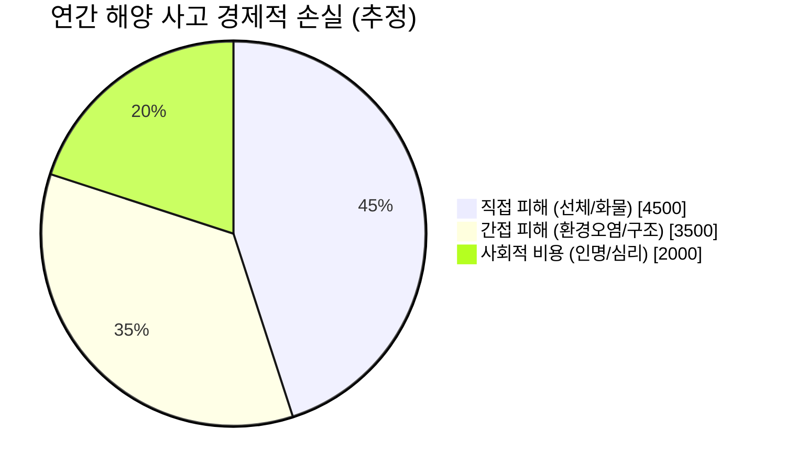

전문가들은 **연간 총 경제적 손실액을 최소 1조 원 이상**으로 추산하고 있습니다. 여기에 인명 피해로 인한 사회적 비용—유가족 지원, 심리 치료, 사회적 불안감 증가 등—은 경제적 수치로 환산할 수 없는 **무한대의 가치**를 가집니다. I-SEDSS는 이러한 피해를 사전에 예방하거나 최소화함으로써 막대한 사회적·경제적 가치를 창출할 수 있습니다.

### 1.3 정책적 필요성

#### 1.3.1 국내 정책 동향

세월호 참사 이후 대한민국 정부는 해양 안전 강화를 위한 다양한 정책과 법규를 도입해 왔습니다. 2020년 해사안전법 개정을 통해 여객선 안전관리체계가 대폭 강화되었으며, 해양수산부는 '스마트 해운물류 발전계획'을 통해 **2030년까지 자율운항선박 상용화**라는 야심찬 목표를 제시했습니다.

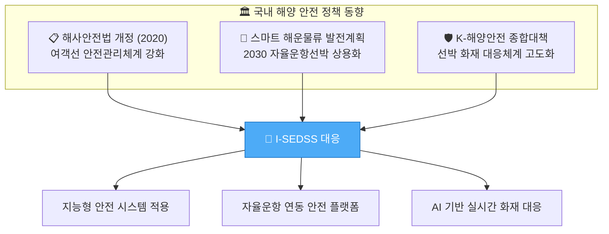

특히 'K-해양안전 종합대책'에서는 **선박 화재 예방 및 대응체계 고도화**를 핵심 과제로 설정하고, 첨단 기술을 활용한 선제적 안전관리 시스템 도입을 권장하고 있습니다. I-SEDSS는 이러한 정책 방향과 완벽하게 부합하는 기술 솔루션으로서, 정부 정책 이행의 핵심 수단이 될 수 있습니다.

#### 1.3.2 국제 규제 동향

국제적으로도 선박 안전 규제는 지속적으로 강화되는 추세입니다. **IMO SOLAS Convention**의 Chapter II-2는 선박 화재 안전에 관한 가장 권위 있는 국제 기준으로, 최근 개정을 통해 첨단 화재 감지 및 대응 시스템 도입을 촉구하고 있습니다.

유럽연합(EU)은 2025년부터 일정 규모 이상의 여객선에 **첨단 화재 감지 시스템 의무화**를 검토 중이며, 주요 선급 기관인 DNV GL과 Lloyd's Register는 '스마트십(Smart Ship)' 인증 기준에 **AI 기반 안전 시스템**을 필수 요건으로 포함시키는 방안을 논의하고 있습니다.

이러한 국제 동향은 I-SEDSS와 같은 지능형 해양 안전 시스템에 대한 **글로벌 수요가 폭발적으로 증가**할 것임을 예고합니다. 선제적으로 기술을 확보하고 국제 인증을 획득하는 것은 국가 경쟁력 확보 차원에서도 매우 중요한 과제입니다.

---


## 2. 연구개발과제의 목표 및 내용

### 1) 연구개발과제의 최종 목표

#### 핵심 목표

> **"AI 기반 실시간 재난 인지 → 동적 대피경로 생성 → 지능형 피난유도"를 통합한 선박 복합 재난 안전 지원 시스템 개발 및 실선 실증 (TRL 7 달성)**

I-SEDSS의 핵심 철학은 **"수집(Sensing) → 분석(Analysis) → 전파(Notify) → 유도(Guidance)"**라는 4단계 가치 사슬을 단일 플랫폼으로 통합하여, 재난 발생부터 안전한 대피 완료까지의 전 과정을 **자동화·지능화**하는 것입니다.

기존 시스템에서는 각 단계가 분절되어 운영되어 병목 현상이 발생했습니다. I-SEDSS는 이 모든 단계를 **실시간으로 연결**하여, 위기 상황 감지 후 **30초 이내에 최적 대피 경로를 생성**하고 **2분 이내에 대피를 시작**할 수 있도록 합니다.

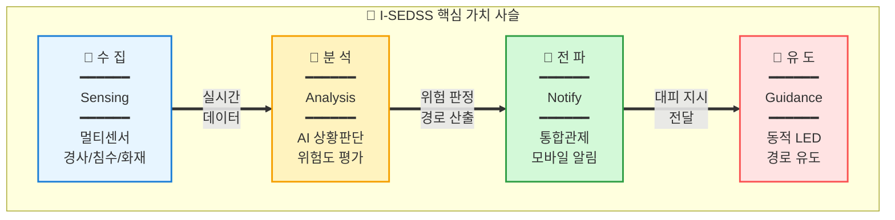

이 통합 가치 사슬은 단순히 기술적 연결에 그치지 않습니다. 각 단계에서 생성되는 데이터는 다음 단계로 즉시 전달되며, 최종 대피 결과는 다시 분석 단계로 피드백되어 **AI 모델의 지속적 학습과 개선**에 활용됩니다. 이를 통해 시스템은 운영할수록 더 정확하고 효율적인 대피 지원을 제공할 수 있게 됩니다.

#### 최종 목표 성과물

본 과제를 통해 도출할 3대 핵심 성과물은 다음과 같습니다. 각 성과물은 명확한 정량적 달성 기준을 가지며, 새동백호 실선 실증을 통해 검증됩니다.

| 구분 | 목표 | 달성 기준 |
|:---|:---|:---|
| **다중변수 대피경로 탐색 모델** | AI 기반 실시간 재탐색 S/W 시제품 | 탐색 정확도 90% 이상, 3초 이내 |
| **통합 의사결정 지원 모듈** | 중앙관제/유도등 연동 인터페이스 | 오차율 5% 미만 |
| **실시간 피난유도 시스템** | 승조원/승객 단말 연동 앱 | 실증 대피 일치율 85% 이상 |

### 2) 연구개발과제의 단계별 목표

#### 전체 로드맵 (2026-2028)

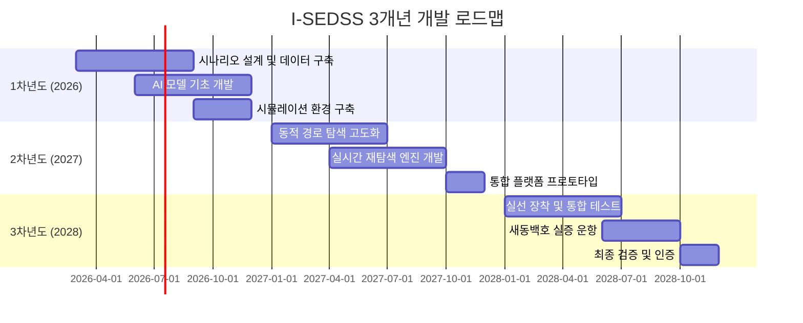

#### 연차별 상세 목표

| 연차 | 핵심 목표 | 주요 산출물 | TRL |
|:---:|:---|:---|:---:|
| **1차년도** | AI 대피경로 탐색 및 기초 시스템 구축 | 시나리오 DB, 기초 AI 모델, 시뮬레이션 환경 | TRL 4→5 |
| **2차년도** | 실시간 대피경로 재탐색 모델 고도화 | 동적 재탐색 엔진, 통합 플랫폼 프로토타입 | TRL 5→6 |
| **3차년도** | 선박 실증 및 지능형 SOP 확정 | 실선 실증 완료, 인증 획득, SOP 문서화 | TRL 6→7 |

### 3) 연구개발과제의 내용

#### 3.1 핵심 연구 내용

본 과제의 핵심 연구 내용은 사고 상황 인지부터 안전한 대피 완료까지의 전 과정을 지능화하는 4개 핵심 모듈로 구성됩니다. 각 모듈은 독립적으로 개발되면서도, 통합 플랫폼을 통해 유기적으로 연동되어 시너지 효과를 창출합니다.

##### 3.1.1 다중변수 복합 재난 대피경로 탐색 모델 개발

선박 내 대피 경로 탐색은 단순한 최단 거리 계산이 아닙니다. 재난 위치, 선체 경사도(Tilt/Heel), 침수 구역, 연기 확산 방향, 각 통로의 통행 가능 여부, 승객 밀집도 등 **복합적인 변수를 동시에 고려**해야 합니다. 본 연구에서는 그래프 신경망(GNN)과 분산 최적화 알고리즘(DPOP)을 결합한 새로운 경로 탐색 모델을 개발합니다.

| 세부 내용 | 설명 |
|:---|:---|
| **시나리오 기반 데이터셋 구축** | 화재, 침수, 폭발 등 10개 이상 재난 시나리오 정의 및 시뮬레이션 데이터 생성 |
| **GNN/DPOP 기반 경로 탐색** | 그래프 신경망을 활용한 최적 경로 탐색 알고리즘 개발 |
| **FDS 연동 화재 확산 예측** | Fire Dynamics Simulator 연동으로 3초 단위 화재 확산 예측 |

특히 Fire Dynamics Simulator(FDS) 및 침수 시뮬레이션을 연동하여 재난 확산을 **3초 단위로 예측**하고, 이를 기반으로 경로를 **동적으로 재계산**하는 것이 본 모델의 핵심 차별점입니다. 선체 경사로 인해 보행 속도가 저하되거나 침수된 구역은 즉시 회피 경로에서 제외하여 승객들을 안전하게 유도합니다.

##### 3.1.2 AI 복합 재난 상황 인지 및 센서 퓨전 기술

정확한 상황 인지는 전체 시스템의 신뢰성을 좌우하는 가장 중요한 첫 단계입니다. 단일 센서에 의존하는 기존 시스템과 달리, I-SEDSS는 **LiDAR, 열화상, 침수/경사 센서, CCTV** 등 이기종 센서들의 데이터를 **AI 기반으로 통합 분석**하여 사고 유형과 규모를 정확히 판정합니다.

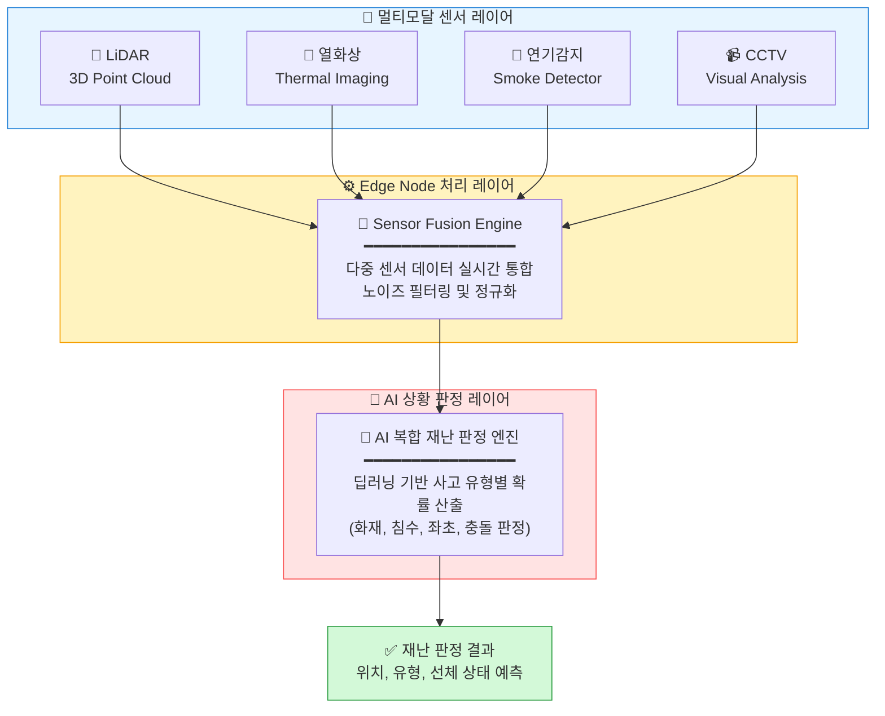

각 센서는 서로 다른 물리적 현상을 측정하기 때문에, **상호 보완적인 정보를 제공**합니다. 예를 들어 침수 센서의 1차 신호와 선체 경사계의 급격한 변화, 그리고 열화상 카메라의 온도 데이터 분석을 결합하면 단순한 침수와 화재가 동반된 **복합 위기 상황의 중증도를 99% 이상의 정확도**로 판정할 수 있습니다.

##### 3.1.3 지능형 피난유도 시스템

위기 상황이 인지되고 대피 경로가 계산되면, 이를 승객과 승조원에게 **신속하고 명확하게 전달**해야 합니다. I-SEDSS는 세 가지 채널을 통해 대피 유도 정보를 전달합니다.

| 구성요소 | 기능 | 기술 사양 |
|:---|:---|:---|
| **동적 LED 유도등** | 실시간 경로 변경에 따른 방향 지시 | RGB LED, 저조도 가시성 확보 |
| **모바일 단말 앱** | 승조원/승객 개인별 대피 경로 안내 | iOS/Android, UWB 위치추적 연동 |
| **브릿지 통합 관제** | 3D 디지털 트윈 기반 종합 상황 전시 | WebGL 기반 실시간 렌더링 |

특히 **동적 LED 유도등**은 기존의 정적 표지판을 완전히 대체하는 혁신적인 요소입니다. 화재 위치와 연기 확산에 따라 **방향이 실시간으로 변경**되어, 승객들을 항상 안전한 경로로 유도합니다. 정전 상황에서도 자체 배터리로 30분 이상 동작하도록 설계됩니다.

##### 3.1.4 설명 가능한 AI (XAI) 시스템

AI가 추천한 대피 경로를 선장과 승조원이 신뢰하고 따르려면, AI의 판단 근거를 **명확하게 설명**할 수 있어야 합니다. I-SEDSS는 설명 가능한 AI(XAI) 기술을 통해 모든 판단에 대한 **투명한 근거를 제시**합니다.

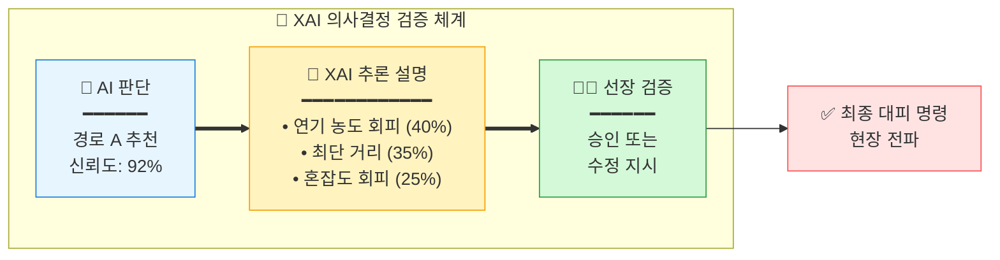

예를 들어 AI가 "경로 A를 추천합니다"라고 할 때, XAI 모듈은 "경로 A가 추천된 이유는 ① 현재 연기 농도가 낮음(40% 가중치), ② 최단 거리(35% 가중치), ③ 예상 혼잡도가 낮음(25% 가중치)입니다"라고 설명합니다. 선장은 이 설명을 바탕으로 **최종 승인 또는 수정 지시**를 내릴 수 있으며, 이는 AI에 대한 신뢰를 높이는 동시에 인간의 최종 결정권을 보장합니다.

##### 3.1.5 SOLAS SOP 기반 위기 상황 시나리오 정의

I-SEDSS는 단순 화재를 넘어 SOLAS(국제해사기구 인명안전협약)의 표준 운영 절차(SOP)를 기반으로 한 5대 핵심 위기 상황 시나리오를 정의하고, 각 상황별 최적 대응 체계를 구축합니다.

| 시나리오 | 사고 인식 방법 (Recognition) | 대응 체계 (Response System) | I-SEDSS 연동 및 지원 |
|:---:|:---|:---|:---|
| **선박 좌초**<br/>(Grounding) | • 수심 감측기(Echo Sounder) 급격 변화<br/>• 선체 진동 및 소음 발생<br/>• 선속의 갑작스러운 감소 | • 선체 파손 부위 확인 및 침수량 계산<br/>• 복원성 계산 및 평형수 조정<br/>• 구명정 대기 및 승객 구역 배치 | • 선체 경사도 실시간 분석<br/>• 구역별 침수 확산 속도 예측<br/>• 최적 탈출 시점 및 경로 산출 |
| **선박 충돌**<br/>(Collision) | • 레이더(ARPA/AIS) 근접 경보<br/>• 시각적 확인 및 충돌 충격<br/>• 수밀문 폐쇄 신호 발생 | • 침수 구역 격리(수밀문 폐쇄)<br/>• 화재 발생 여부 즉시 확인<br/>• 인명 피해 파악 및 응급처치 | • 센서 퓨전 기반 파손 부위 정밀 판단<br/>• 충돌 충격에 따른 센서 네트워크 복구<br/>• 구획별 고립자 위치 실시간 파악 |
| **태풍 및 악천후**<br/>(Heavy Weather) | • 기상 팩스 및 기상 레이더 정보<br/>• 선체 롤링/피칭 반경 급증<br/>• 외부 갑판 센서 데이터 이상 | • 화물 고삭 상태 재점검<br/>• 외부 갑판 출입 전면 통제<br/>• 풍랑에 따른 침로 및 속력 조정 | • 실시간 복원성 스코어링 제시<br/>• 낙상 사고 위험 구역 예측 및 경고<br/>• 승객 밀집 구역의 진동 제어 안내 |
| **화재 및 확산**<br/>(Fire Spread) | • AI 멀티모달 센서(LiDAR/열화상) 감지<br/>• 화재 경보 시스템(FAS) 작동<br/>• 농연 발생 및 가시거리 저하 | • 초기 진화 및 수동 소화 시도<br/>• 방화문/댐퍼 폐쇄 및 환기 제어<br/>• 전 구역 대피 방송 및 유도 | • **[핵심기능]** 동적 대피 경로 재계산<br/>• 화재 확산 3초 단위 3D 예측<br/>• XAI 기반 선장 의사결정 지원 |
| **대규모 유류 유출**<br/>(Oil Spill) | • 연료 탱크 유량계(Level Gauge) 급감<br/>• 해수면 유막 형성 시각 감측<br/>• 선내 악취 및 유증기 농도 상승 | • 유출 차단 조치 및 오일펜스 전개<br/>• 방제 자재 살포 및 관계 기관 보고<br/>• 폭발 위험 구역 접근 통제 | • 유증기 확산에 따른 폭발 위험지수 산출<br/>• 방제 인력의 안전 경로 안내<br/>• 환경 피해 최소화 위한 선체 자세 권고 |

### 4) 연구개발과제 수행일정 및 주요 결과물

#### 간트 차트 (Gantt Chart)

| 연구 내용 | 1차년도 | | | | 2차년도 | | | | 3차년도 | | | |
|:---|:---:|:---:|:---:|:---:|:---:|:---:|:---:|:---:|:---:|:---:|:---:|:---:|
| | Q1 | Q2 | Q3 | Q4 | Q1 | Q2 | Q3 | Q4 | Q1 | Q2 | Q3 | Q4 |
| 시나리오 설계 | ██ | ██ | | | | | | | | | | |
| 데이터셋 구축 | | ██ | ██ | ██ | | | | | | | | |
| AI 모델 개발 | | | ██ | ██ | ██ | ██ | | | | | | |
| 시뮬레이션 환경 | | | | ██ | ██ | | | | | | | |
| 동적 재탐색 엔진 | | | | | ██ | ██ | ██ | | | | | |
| 통합 플랫폼 개발 | | | | | | ██ | ██ | ██ | | | | |
| 하드웨어 설치 | | | | | | | | ██ | ██ | | | |
| 실선 통합 테스트 | | | | | | | | | ██ | ██ | ██ | |
| 최종 검증/인증 | | | | | | | | | | | ██ | ██ |

#### 연차별 주요 결과물

| 연차 | 결과물 | 유형 | 비고 |
|:---:|:---|:---:|:---|
| 1차년도 | 재난 시나리오 데이터셋 (10종 이상) | DB | PyroSim/Pathfinder 데이터 |
| 1차년도 | 기초 AI 대피경로 탐색 모델 v1.0 | S/W | Python/TensorFlow |
| 2차년도 | 실시간 재탐색 엔진 v2.0 | S/W | Edge 최적화 버전 |
| 2차년도 | 통합 관제 플랫폼 프로토타입 | S/W | Web 기반 |
| 3차년도 | 새동백호 실증 보고서 | 문서 | 성능 검증 결과 |
| 3차년도 | 지능형 SOP 매뉴얼 | 문서 | 표준 운영 절차 |

---

### 5) 연차별 세부 수행 내용

> [!NOTE]
> 본 섹션은 각 연차별로 수행할 **구체적인 연구 활동, 방법론, 기대 산출물**을 상세히 기술합니다.

---

#### 5.1 1차년도 (2026년): 기초 시스템 구축 및 AI 모델 개발

**1차년도 목표**: AI 대피경로 탐색 알고리즘 개발 및 시뮬레이션 기반 검증 환경 구축 (TRL 4→5)

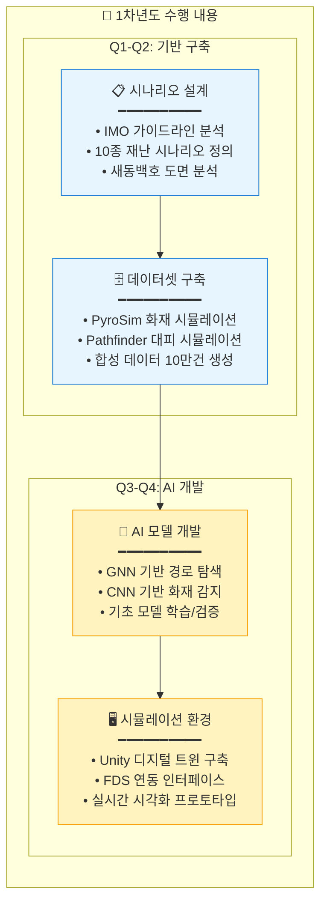

##### 5.1.1 시나리오 설계 및 데이터 수집 (Q1-Q2)

| 세부 과제 | 수행 내용 | 연구 방법 | 담당 기관 | 산출물 |
|:---|:---|:---|:---|:---|
| **재난 시나리오 정의** | SOLAS SOP 기반 5대 위기 상황 시나리오 설계 | IMO MSC.1/Circ.1238 및 SOLAS 분석 | 전남대 | 시나리오 명세서 |
| **새동백호 도면 분석** | 선박 구조 모델링, 대피 경로 그래프화 | CAD 도면 디지털화, BIM 변환 | 전남대 | 3D BIM 모델 |
| **화재 시뮬레이션** | FDS 기반 화재 확산 데이터 생성 | PyroSim으로 화재 역학 시뮬레이션 | 전남대 | 화재 확산 DB |
| **대피 시뮬레이션** | 승객 이동 패턴 데이터 생성 | Pathfinder로 군중 시뮬레이션 | 전남대 | 대피 경로 DB |

**연구 방법론 상세:**

1. **시나리오 기반 설계 (Scenario-Based Design)**
   - SOLAS SOP 및 IMO 가이드라인에서 정의한 위기 상황 분류 체계 통합 활용
   - **5대 핵심 시나리오**: 화재 및 확산, 선박 좌초, 선박 충돌, 태풍 및 악천후, 대규모 유류 유출
   - 발생 위치 및 규모: 각 시나리오별 물리적 특성에 따른 구역 정의 (예: 기관실 화재, 선저 좌초 등)
   - 시간대: 주간/야간, 운항 중/정박 중 변수 적용

2. **합성 데이터 생성 (Synthetic Data Generation)**
   ```
   데이터 구성:
   ├── 화재 데이터: 위치(x,y,z), 온도, 연기농도, 확산속도
   ├── 승객 데이터: 위치, 이동속도, 밀집도, 취약계층 여부
   ├── 환경 데이터: 통로 상태, 방화문 상태, 조명 상태
   └── 레이블: 최적 대피 경로, 소요 시간, 위험 구역
   ```

##### 5.1.2 AI 모델 기초 개발 (Q2-Q4)

| 세부 과제 | 수행 내용 | 연구 방법 | 담당 기관 | 산출물 |
|:---|:---|:---|:---|:---|
| **재난 상황 인지 모델** | 센서 퓨전 기반 사고 유형 및 위치 판정 | CNN + Attention 아키텍처 | 한빛안전기술 | 상황 인지 모델 v1.0 |
| **경로 탐색 모델** | 그래프 기반 최적 경로 탐색 | GNN + DPOP 알고리즘 | 한빛안전기술 | 경로 탐색 모델 v1.0 |
| **위험도 평가 모델** | 구역별 실시간 위험도 스코어링 | Transformer 시계열 예측 | 한빛안전기술 | 위험도 평가 모델 v1.0 |
| **엣지 컴퓨팅 통합** | E2E 추론 파이프라인 구축 | PyTorch + TensorRT 최적화 | 한빛안전기술 | 통합 추론 엔진 v1.0 |

**AI 모델 아키텍처:**

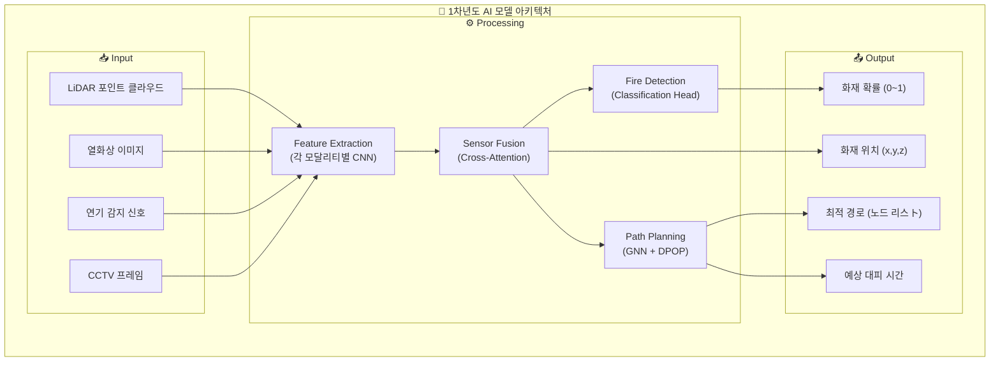

##### 5.1.3 시뮬레이션 환경 구축 (Q3-Q4)

| 세부 과제 | 수행 내용 | 연구 방법 | 담당 기관 | 산출물 |
|:---|:---|:---|:---|:---|
| **디지털 트윈 개발** | 새동백호 3D 모델 기반 가상 환경 | Unity + WebGL | 전남대 | 디지털 트윈 v1.0 |
| **FDS 연동** | 실시간 화재 확산 시각화 | FDS-Unity 브릿지 개발 | 전남대 | FDS 연동 모듈 |
| **관제 플랫폼 설계** | 통합 관제 시스템 아키텍처 설계 | 마이크로서비스 설계 | 오든 | 관제 플랫폼 설계서 |

##### 5.1.4 1차년도 마일스톤

| 시점 | 마일스톤 | 달성 기준 | 검증 방법 |
|:---:|:---|:---|:---|
| M3 | 시나리오 설계 완료 | 10종 시나리오 명세서 승인 | 전문가 리뷰 |
| M6 | 데이터셋 1차 구축 | 5만건 이상 학습 데이터 | 데이터 품질 검증 |
| M9 | AI 모델 v1.0 완료 | 시뮬레이션 정확도 80% | 벤치마크 테스트 |
| M12 | 시뮬레이션 환경 완료 | 디지털 트윈 동작 확인 | 시연 데모 |

---

#### 5.2 2차년도 (2027년): 실시간 시스템 고도화 및 플랫폼 개발

**2차년도 목표**: 실시간 동적 경로 재탐색 엔진 고도화 및 통합 관제 플랫폼 개발 (TRL 5→6)

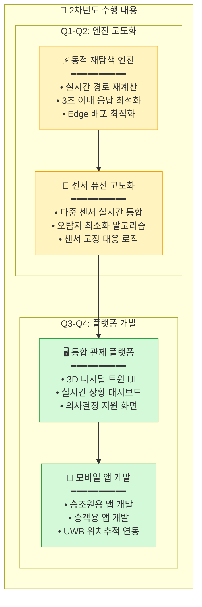

##### 5.2.1 동적 경로 재탐색 엔진 고도화 (Q1-Q3)

| 세부 과제 | 수행 내용 | 연구 방법 | 담당 기관 | 산출물 |
|:---|:---|:---|:---|:---|
| **실시간 재탐색 알고리즘** | 복합 재난 확산에 따른 동적 경로 재계산 | Incremental GNN + A* | 한빛안전기술 | 재탐색 엔진 v2.0 |
| **Edge 최적화** | Jetson AGX 배포용 경량화 | TensorRT + Quantization | 한빛안전기술 | Edge 최적화 모델 |
| **센서 데이터 검증** | 실시간 데이터 수집/검증 | 센서 캘리브레이션 | 해양수산과학기술연구조합 | 데이터 품질 보고서 |
| **실시간 분석 고도화** | 분석 알고리즘 성능 향상 | 모델 튜닝 + 벤치마크 | 한빛안전기술 | 고도화 모델 |

**실시간 재탐색 알고리즘 상세:**

```
재탐색 트리거 조건:
├── 상황 변화: 재난 위치(화재/침수) 및 선체 상태 변화 시
├── 통로 차단: 센서 데이터로 통행 불가 감지 시
├── 밀집도 초과: 특정 구역 혼잡도 임계치 초과 시
├── 시간 경과: 마지막 계산 후 30초 경과 시
└── 수동 요청: 선장 또는 관제관의 수동 재계산 요청 시

재탐색 프로세스:
1. 트리거 감지 (< 100ms)
2. 영향 구역 식별 (< 200ms)
3. 부분 그래프 재구성 (< 500ms)
4. 경로 재계산 (< 1500ms)
5. 유도등/앱 업데이트 명령 전송 (< 700ms)
━━━━━━━━━━━━━━━━━━━━━━
총 소요 시간: < 3000ms (3초)
```

##### 5.2.2 통합 관제 플랫폼 개발 (Q2-Q4)

| 세부 과제 | 수행 내용 | 연구 방법 | 담당 기관 | 산출물 |
|:---|:---|:---|:---|:---|
| **통합 대시보드 개발** | 실시간 선박 상황 3D 시각화 | React + Three.js + WebGL | 오든 | 관제 UI v1.0 |
| **상황 대시보드** | 센서 상태, 알림, 대피 현황 | React + D3.js | 오든 | 대시보드 v1.0 |
| **XAI 인터페이스** | AI 판단 근거 시각화 | SHAP + Custom UI | 한빛안전기술 | XAI UI v1.0 |
| **외부 통신 연동** | 육상관제/해경 연동 API | REST API + MQTT | 오든 | 외부 연동 모듈 |

##### 5.2.3 모바일 앱 및 유도 시스템 개발 (Q3-Q4)

| 세부 과제 | 수행 내용 | 연구 방법 | 담당 기관 | 산출물 |
|:---|:---|:---|:---|:---|
| **승조원 앱** | 상세 상황 정보, 지시 수신 | React Native + Wi-Fi | 오든 | 승조원 앱 v1.0 |
| **승객 앱** | 간단한 대피 경로 안내 | React Native | 오든 | 승객 앱 v1.0 |
| **동적 LED 유도등 프로토콜** | 실시간 방향 제어 프로토콜 | RS-485 + MQTT | 해양수산과학기술연구조합 | LED 제어 프로토콜 |
| **센서 데이터 통합** | 다중 센서 실시간 통합 | 센서 퓨전 알고리즘 | 해양수산과학기술연구조합 | 센서 통합 모듈 |

##### 5.2.4 2차년도 마일스톤

| 시점 | 마일스톤 | 달성 기준 | 검증 방법 |
|:---:|:---|:---|:---|
| M15 | 재탐색 엔진 v2.0 완료 | 3초 이내 응답, 정확도 85% | 성능 벤치마크 |
| M18 | 센서 퓨전 고도화 완료 | 오탐지율 5% 미만 | 시뮬레이션 테스트 |
| M21 | 관제 플랫폼 프로토타입 | 핵심 기능 80% 구현 | 기능 시연 |
| M24 | 통합 시스템 Lab 테스트 | E2E 시나리오 통과 | 통합 테스트 |

---

#### 5.3 3차년도 (2028년): 실선 실증 및 인증 획득

**3차년도 목표**: 새동백호 실선 실증 및 IEC/SOLAS 인증 획득 (TRL 6→7)

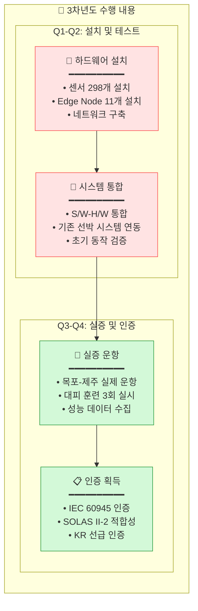

##### 5.3.1 하드웨어 설치 및 시스템 통합 (Q1-Q2)

| 세부 과제 | 수행 내용 | 연구 방법 | 담당 기관 | 산출물 |
|:---|:---|:---|:---|:---|
| **센서 설치** | 298개 센서 현장 설치 | 도면 기반 시공 | 해양수산과학기술연구조합 | 센서 설치 완료 |
| **Edge Node 설치** | 11개 Edge Node 랙 설치 | 전원/네트워크 공사 | 해양수산과학기술연구조합 | Edge 인프라 완료 |
| **네트워크 구성** | 광케이블 백본 + Wi-Fi 6 | 선박 내 배선 공사 | 해양수산과학기술연구조합 | 네트워크 완료 |
| **S/W 배포** | 전체 시스템 온보드 배포 | Docker + K8s | 오든 | 시스템 배포 완료 |
| **실증 선박 운영** | 새동백호 운항 지원 | 선박 운영 관리 | 전남대 | 운항 지원 보고서 |

##### 5.3.2 실선 실증 운항 (Q2-Q3)

| 세부 과제 | 수행 내용 | 연구 방법 | 담당 기관 | 산출물 |
|:---|:---|:---|:---|:---|
| **시스템 안정화** | 실 운항 환경에서 버그 수정 | 모니터링 + 핫픽스 | 오든 | 안정화 보고서 |
| **대피 훈련 1차** | 야간 재난(화재/좌초) 시나리오 | 실제 승조원 참여 | 전남대 | 1차 훈련 결과 |
| **대피 훈련 2차** | 주간 복합(화재+침수) 시나리오 | 승객 참여 (자원자) | 전남대 | 2차 훈련 결과 |
| **대피 훈련 3차** | 광역 복합 재난 시나리오 | 전체 훈련 | 전남대 | 3차 훈련 결과 |
| **데이터 수집 검증** | KPI 달성 여부 측정 | 자동 로깅 + 수동 측정 | 해양수산과학기술연구조합 | 데이터 검증 보고서 |

**대피 훈련 상세 계획:**

```
훈련 1차 (M28): 야간 복합 재난 대응
├── 시나리오: 기관실 화재 및 선저 좌초 상황, 야간 23:00
├── 참여: 승조원 전원 (약 50명)
├── 목표: 시스템 알림 → 대피 시작 2분 이내
└── 측정: 감지 시간, 경로 정확도, 대피 완료 시간

훈련 2차 (M30): 주간 복합 재난 대응
├── 시나리오: 주방 화재 및 차량 구역 침수 상황, 주간 14:00
├── 참여: 승조원 + 승객 자원자 (약 200명)
├── 목표: 동적 경로 재탐색 검증
└── 측정: 재탐색 응답 시간, 혼잡 구역 회피율

훈련 3차 (M32): 복합 재난 (Collision & Fire)
├── 시나리오: 선박 충돌에 따른 화재 발생 + 정전 + 통신 두절, 야간 03:00
├── 참여: 전체 승객 (최대 수용 시)
├── 목표: 자율 Edge 운영 검증, 전체 시스템 검증
└── 측정: 전체 KPI 10개 항목
```

##### 5.3.3 인증 획득 (Q3-Q4)

| 세부 과제 | 수행 내용 | 연구 방법 | 담당 기관 | 산출물 |
|:---|:---|:---|:---|:---|
| **IEC 60945 시험** | 해상 환경 내구성 시험 | EMC, 진동, 온습도 시험 | KCL | IEC 60945 인증서 |
| **SOLAS II-2 적합성** | 화재 안전 규격 적합성 | 문서 심사 + 현장 심사 | KCL | 적합성 확인서 |
| **KR 선급 인증** | 한국선급 형식 승인 | 설계 심사 + 제품 시험 | KCL | KR 형식승인 인증 |
| **SOP 문서화** | 지능형 표준 운영 절차서 | 훈련 결과 기반 작성 | 오든 | 지능형 SOP 매뉴얼 |

##### 5.3.4 3차년도 마일스톤

| 시점 | 마일스톤 | 달성 기준 | 검증 방법 |
|:---:|:---|:---|:---|
| M25 | 1단계 인프라 설치 | 기반 센서/장비 설치 완료 | 현장 검수 |
| M30 | 시스템 통합 완료 | E2E 시나리오 통과 | 통합 테스트 |
| M33 | 대피 훈련 3회 완료 | 목표 KPI 달성 | 훈련 평가 |
| M36 | 인증 획득 완료 | IEC/SOLAS/KR 인증 | 인증서 발급 |

---


## 3. 연구개발과제의 추진전략·방법 및 추진체계

### 1) 연구개발과제의 추진전략⋅방법

#### 3.1.1 핵심 추진 전략

I-SEDSS 개발의 성공을 위해 4대 핵심 전략 기술을 중심으로 연구개발을 추진합니다. 각 전략은 기존 시스템의 한계를 극복하고 차별화된 가치를 창출하기 위해 설정되었습니다.

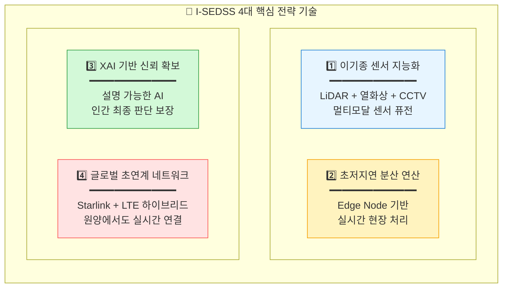

**첫째, 이기종 센서 지능화**는 LiDAR, 열화상 카메라, CCTV 등 서로 다른 특성의 센서 데이터를 AI 기반으로 통합 분석하여, 단일 센서로는 불가능한 정확하고 신뢰성 있는 화재 감지를 가능하게 합니다.

**둘째, 초저지연 분산 연산**은 클라우드 의존 없이 선박 내 Edge Node에서 실시간 데이터 처리를 수행하여, 통신 지연이나 두절 상황에서도 시스템이 독립적으로 동작할 수 있도록 합니다.

**셋째, XAI 기반 신뢰 확보**는 AI의 모든 판단에 대해 명확한 근거를 제시하여, 선장과 승조원이 AI 권고를 신뢰하고 따를 수 있도록 하면서도 인간의 최종 결정권을 보장합니다.

**넷째, 글로벌 초연계 네트워크**는 Starlink 위성통신과 LTE를 하이브리드로 활용하여, 원양 항해 중에도 육상 관제센터 및 해경과의 실시간 데이터 교환을 가능하게 합니다.

#### 3.1.2 기술 개발 방법론

본 과제는 국제해사기구(IMO)의 가이드라인을 철저히 준수하면서, 최신 AI 기술과 디지털 트윈 시뮬레이션을 결합한 체계적인 방법론을 적용합니다.

| 단계 | 방법 | 도구/플랫폼 |
|:---|:---|:---|
| **시나리오 설계** | IMO MSC.1/Circ.1238 가이드라인 준수 | PyroSim, Pathfinder |
| **데이터 생성** | FDS 기반 Synthetic Data 생성 | Fire Dynamics Simulator |
| **AI 모델 개발** | GNN, Transformer 기반 경로 탐색 | PyTorch, TensorFlow |
| **시뮬레이션** | 디지털 트윈 연동 성능 검증 | Unity, Unreal Engine |
| **실증** | 새동백호 실선 장착 및 해상 테스트 | 실선 운항 환경 |

특히 IMO MSC.1/Circ.1238은 신조 및 현존 여객선의 대피 분석에 관한 국제 표준 가이드라인으로, I-SEDSS의 시나리오 설계와 성능 평가의 기준으로 활용됩니다. 이를 통해 개발된 시스템이 국제적으로 인정받을 수 있는 기반을 마련합니다.

#### 3.1.3 리스크 관리 전략

해상 환경은 예측 불가능한 상황이 빈번히 발생하므로, 시스템의 **장애 허용성(Fault Tolerance)**은 매우 중요합니다. I-SEDSS는 발생 가능한 주요 리스크에 대해 사전에 완화 전략과 대응 방안을 수립합니다.

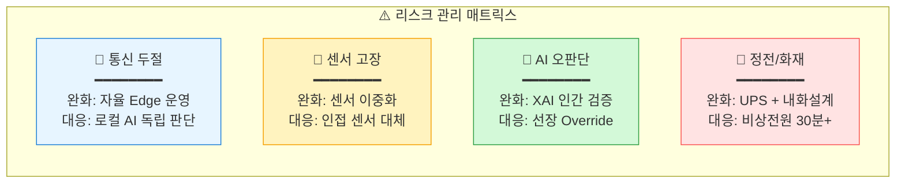

특히 **통신 두절** 상황에 대한 대응이 핵심입니다. 원양 항해 중 위성 통신이 끊어지더라도, 각 Edge Node가 독립적으로 AI 판단을 수행하고 대피 유도를 계속할 수 있도록 설계됩니다. 이는 I-SEDSS가 진정한 의미의 **자율적 안전 시스템**으로 기능할 수 있게 하는 핵심 요소입니다.

### 2) 연구개발과제의 추진체계

#### 3.2.1 컨소시엄 구성도

본 과제는 주관기관 (주)오든을 중심으로, AI 핵심 기술, 선박 인프라, 학술 연구, 인증 시험 분야의 최고 전문 기관들이 참여하는 **5개 기관 컨소시엄**으로 구성됩니다. 각 기관은 고유한 강점을 바탕으로 유기적으로 협력하여 시스템을 완성합니다.

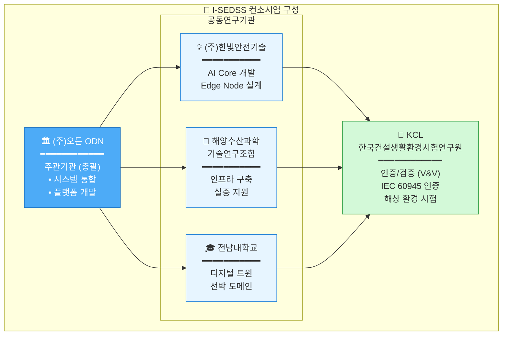

#### 3.2.2 기관별 역할 분담

| 기관 | 역할 | 주요 담당 업무 |
|:---|:---:|:---|
| **(주)오든** | 주관 | 총괄 PM, 시스템 통합, 플랫폼 개발, 실증 총괄 |
| **(주)한빛안전기술** | 공동 | AI 엔진 개발, Edge Node 설계, 센서 퓨전 알고리즘 |
| **해양수산과학기술연구조합** | 공동 | 실증 선박 인프라 구축, 통신 네트워크, 현장 지원 |
| **전남대학교** | 공동 | 디지털 트윈 개발, 선박 구조 모델링, 시뮬레이션 |
| **KCL** | 공동 | 인증 시험, 해상 환경 검증, V&V 프로세스 |

#### 3.2.3 실증 선박: 새동백호

| 항목 | 사양 |
|:---|:---|
| **선명** | 새동백호 (Sae-Dongbaek) |
| **선종** | 카페리 (Car Ferry) |
| **총톤수** | 약 10,000 GT |
| **운항 노선** | 목포 ↔ 제주 |
| **실증 내용** | 전 구역 센서 설치, 통합 관제 시스템 운영 |

---

## 4. 연구개발성과의 활용방안 및 기대효과

### 1) 연구개발성과의 활용방안

#### 4.1.1 단계별 활용 계획

I-SEDSS의 기술은 새동백호 실증을 시작으로 점진적으로 적용 범위를 확대해 나가는 전략을 취합니다. 국내 시장에서 기술을 검증하고 안정화한 후, 글로벌 시장으로 진출하여 세계 해양 안전 시장의 선도 기업으로 도약합니다.

| 단계 | 기간 | 활용 방안 |
|:---|:---:|:---|
| **1단계** | 2026-2028 | 새동백호 실증을 통한 기술 검증 및 고도화 |
| **2단계** | 2029-2030 | 국내 여객선 우선 적용 확대 (30척 목표) |
| **3단계** | 2031~ | 글로벌 시장 진출 (크루즈, 화물선 등) |

#### 4.1.2 주요 활용 분야

I-SEDSS 기술은 여객선을 시작으로, 크루즈선, 화물선, 그리고 궁극적으로 **자율운항선박(MASS)**까지 그 적용 범위를 확장할 수 있습니다. 특히 자율운항선박에서는 승조원이 없거나 최소화되기 때문에, AI 기반 자동 안전 시스템은 **필수적인 핵심 기술**이 됩니다.

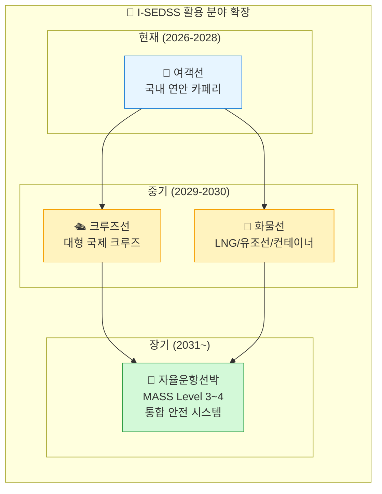

자율운항선박 시장은 2030년까지 급성장이 예상되며, 대한민국 정부도 이 분야에서 글로벌 선도국이 되겠다는 목표를 가지고 있습니다. I-SEDSS는 자율운항선박에 **반드시 탑재되어야 하는 핵심 안전 인프라**로서, 관련 시장 성장과 함께 폭발적인 수요 증가가 예상됩니다.

#### 4.1.3 기술 이전 및 라이선싱

본 과제를 통해 개발된 핵심 기술들은 다양한 형태로 산업계에 이전되어 활용될 수 있습니다. 각 기술 모듈은 독립적으로 라이선싱이 가능하도록 설계되어, 조선소, 해운사, 해양 안전 기업 등에 맞춤형 솔루션을 제공할 수 있습니다.

| 기술 항목 | 이전 대상 | 예상 시기 |
|:---|:---|:---:|
| AI 화재 감지 알고리즘 | 국내 조선소, 해운사 | 2029년 |
| 동적 경로 탐색 엔진 | 글로벌 해양 안전 기업 | 2030년 |
| 통합 관제 플랫폼 | 선급/인증기관 | 2030년 |

### 2) 연구개발성과의 기대효과

#### 4.2.1 정량적 기대효과

I-SEDSS 도입을 통한 가장 핵심적인 개선 효과는 **골든타임 확보**입니다. 화재 감지부터 대피 시작까지의 시간을 획기적으로 단축하여, 승객과 승조원이 안전하게 대피할 수 있는 시간을 확보합니다.

| 지표 | 현재 (As-Is) | 목표 (To-Be) | 개선율 |
|:---|:---:|:---:|:---:|
| **화재 감지 시간** | 10분 이상 | 30초 이내 | **95% 단축** |
| **대피 시작 시간** | 15분 | 2분 | **87% 단축** |
| **대피 완료 시간** | 40분 | 15분 | **63% 단축** |
| **골든타임 확보율** | 30% | 90% | **200% 향상** |

아래 다이어그램은 기존 시스템과 I-SEDSS의 대응 시간을 비교한 것입니다. 기존 시스템에서 30분 이상 소요되던 대피 시작이, I-SEDSS에서는 **단 2분 이내**에 가능해집니다.

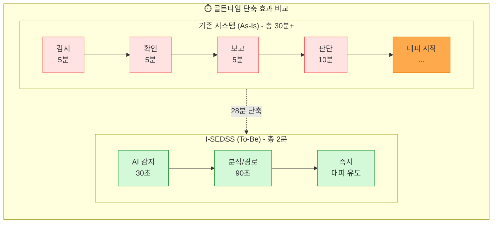

이러한 시간 단축은 단순한 수치가 아닙니다. 선박 화재에서 **5분의 차이가 생사를 가르는** 상황에서, 28분이라는 시간 단축은 **수백 명의 생명을 구할 수 있는** 결정적인 차이입니다.

#### 4.2.2 정성적 기대효과

정량적 효과 외에도 I-SEDSS는 다양한 정성적 가치를 창출합니다. 인명 안전 확보라는 본질적 가치와 함께, 해양 안전 분야의 기술 자립, 산업 경쟁력 강화, 그리고 해운 산업에 대한 국민의 신뢰 회복까지 다층적인 효과가 기대됩니다.

| 구분 | 기대효과 |
|:---|:---|
| **인명 안전** | 선박 화재 시 인명피해 최소화, 골든타임 내 대피 완료 |
| **기술 자립** | 해양 안전 분야 국산 AI 기술 확보 |
| **산업 경쟁력** | 스마트십/자율운항선박 시장 선점 |
| **사회적 신뢰** | 해운 산업에 대한 국민 안전 신뢰 회복 |

특히 **사회적 신뢰 회복**은 매우 중요한 가치입니다. 세월호 참사 이후 대한민국 국민들 사이에 형성된 해상 교통에 대한 불안감은 아직도 남아 있습니다. I-SEDSS와 같은 첨단 안전 시스템의 도입은 "다시는 그런 비극이 발생하지 않을 것"이라는 확신을 국민들에게 심어줄 수 있습니다.

#### 4.2.3 경제적 파급효과

I-SEDSS의 경제적 파급효과는 직접 매출, 해외 수출, 유지보수 서비스, 그리고 피해 예방에 따른 비용 절감까지 다각도로 발생합니다.

| 항목 | 산출 근거 | 예상 효과 |
|:---|:---|---:|
| **직접 매출** | 국내 30척 × 5억원 | 150억 원 |
| **해외 수출** | 글로벌 100척 × 7억원 | 700억 원 |
| **유지보수** | 연간 구독형 서비스 | 50억 원/년 |
| **피해 예방** | 사고 1건당 100억 원 절감 | 300억 원/년 |

---


## 5. 연구개발성과의 사업화 전략 및 계획

### 1) 국내외 시장 동향

#### 5.1.1 글로벌 스마트십 시장

글로벌 스마트 해운·조선 시장은 디지털화와 자율운항 기술의 발전에 힘입어 **폭발적인 성장**이 예상됩니다. 선박의 안전, 효율, 환경 성능을 향상시키기 위한 첨단 기술 투자가 전 세계적으로 확대되고 있으며, 특히 화재를 포함한 안전 분야는 가장 기본적이면서도 중요한 투자 대상입니다.

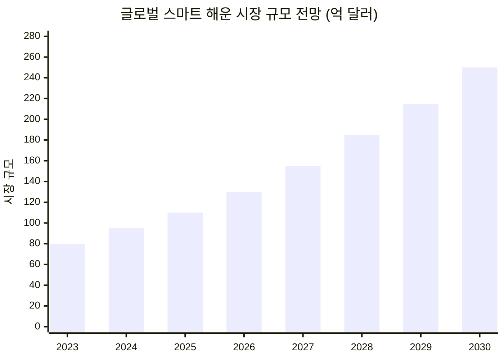

시장 조사 기관들의 분석에 따르면, 글로벌 스마트 해운 시장은 **연평균 12.5%(CAGR)**의 성장률을 기록하며, 2030년에는 **약 250억 달러(약 32조 원)** 규모에 도달할 것으로 전망됩니다. 이 중 안전 관련 시스템은 전체 시장의 약 15~20%를 차지하여, I-SEDSS가 목표로 하는 시장만 해도 **5조 원 이상**의 거대한 기회가 존재합니다.

#### 5.1.2 경쟁사 현황 분석

현재 해양 안전 및 스마트십 분야의 글로벌 선두 기업들은 대부분 유럽에 본사를 두고 있습니다. 그러나 이들 기업은 주로 항해, 추진, 전력 관리 분야에 집중하고 있으며, **화재 감지 및 대피 유도 분야에서는 상대적으로 기술 개발이 미흡**합니다.

| 경쟁사 | 국가 | 주요 기술 | I-SEDSS 대비 차별점 |
|:---|:---:|:---|:---|
| Kongsberg | 노르웨이 | 자율운항 통합 시스템 | 화재 대응 특화 부족 |
| Wärtsilä | 핀란드 | 항해 최적화 솔루션 | AI 피난유도 기능 無 |
| ABB Marine | 스위스 | 추진/전력 관리 | 안전 시스템 별도 구성 |
| **I-SEDSS** | **한국** | **AI 화재 감지 + 동적 대피** | **End-to-End 통합** |

I-SEDSS의 가장 큰 차별점은 화재 감지부터 대피 완료까지의 **전 과정을 하나의 통합 플랫폼**으로 제공한다는 것입니다. 기존 경쟁사들의 솔루션은 감지, 관제, 유도 시스템이 각각 별개의 제품으로 제공되어 통합 운영이 어려웠던 반면, I-SEDSS는 처음부터 **End-to-End 통합 설계**를 기본으로 합니다.

### 2) 지식재산권, 표준화 및 인증기준 현황

#### 5.2.1 특허 확보 전략

핵심 기술에 대한 지식재산권 확보는 사업화 성공의 필수 조건입니다. 본 과제에서는 4건의 핵심 특허를 출원하여, **기술적 해자(Moat)**를 구축합니다. 특허는 국내뿐 아니라 PCT, 미국, EU 등 주요 시장에도 권리를 확보하여 글로벌 사업화에 대비합니다.

| 순번 | 특허명 (예정) | 출원 시기 | 권리범위 |
|:---:|:---|:---:|:---|
| 1 | AI 기반 선박 화재 실시간 감지 방법 및 장치 | 2026 Q2 | 한국, PCT |
| 2 | 동적 대피경로 재탐색 알고리즘 | 2027 Q1 | 한국, 미국, EU |
| 3 | XAI 기반 해상 의사결정 지원 시스템 | 2027 Q3 | 한국, PCT |
| 4 | 멀티모달 센서 퓨전 화재 검출 방법 | 2028 Q1 | 한국, 미국 |

#### 5.2.2 인증 현황 및 계획

선박용 장비는 국제 규격 인증 없이는 실제 선박에 탑재할 수 없습니다. 본 과제에서는 KCL과의 협력을 통해 IEC, SOLAS, ISO 등 필수 인증을 체계적으로 획득합니다.

| 인증/규격 | 내용 | 취득 계획 |
|:---|:---|:---:|
| **IEC 60945** | 해상 항해 장비 일반 요구사항 | 2028년 |
| **SOLAS II-2** | 선박 화재 안전 국제협약 | 2028년 |
| **ISO 19847** | 선박 데이터 표준 | 2028년 |
| **선급 인증** | KR, DNV, Lloyd's | 2029년 |

### 3) 표준화 전략

#### 5.3.1 표준화 추진 계획

기술 리더십 확보를 넘어, **표준화 주도권**을 확보하는 것이 장기적 경쟁력의 핵심입니다. 본 과제에서 개발된 기술을 국내 표준(KS)에서 시작하여 점진적으로 국제 표준(ISO, IEC)으로 확산시키는 전략을 추진합니다.

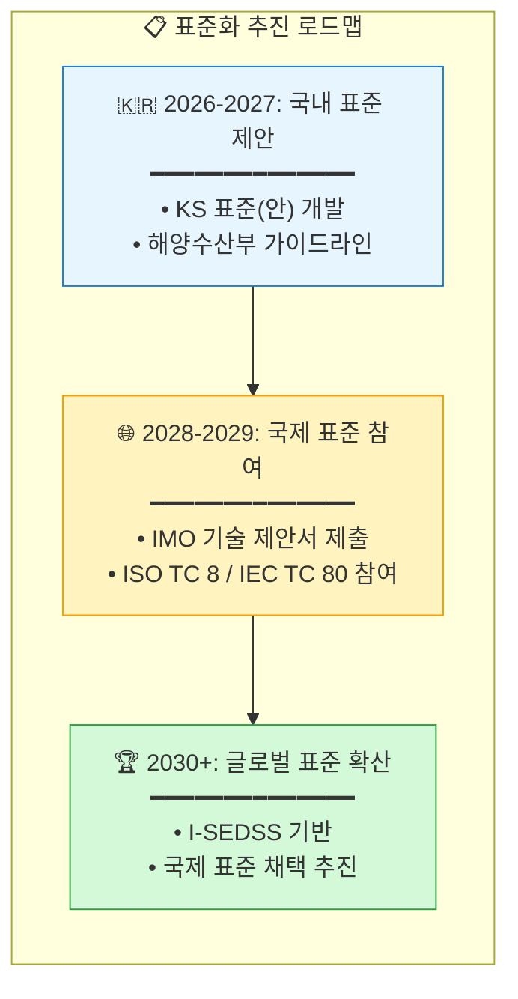

I-SEDSS 기반 기술이 국제 표준으로 채택되면, 해당 표준을 준수하는 모든 선박에서 I-SEDSS 또는 호환 시스템을 채택해야 하므로, **막대한 시장 선점 효과**를 기대할 수 있습니다.

### 4) 사업화 계획

#### 5.4.1 사업화 일정

I-SEDSS의 사업화는 R&D 과제 종료 후 바로 시작할 수 있도록, 과제 수행 기간 중 사업화 준비를 병행합니다. 인증 획득, 양산 설계, 파트너십 구축 등을 미리 진행하여, 2029년부터 본격적인 상용화에 돌입합니다.

| 단계 | 기간 | 주요 활동 |
|:---|:---:|:---|
| **기술 완성** | 2026-2028 | R&D 과제 수행, 실선 실증 완료 |
| **사업화 준비** | 2028-2029 | 인증 취득, 양산 설계, 파트너십 구축 |
| **국내 사업화** | 2029-2030 | 국내 여객선 30척 공급 목표 |
| **글로벌 진출** | 2030~ | 아시아, 유럽, 북미 시장 진출 |

#### 5.4.2 수익 모델

I-SEDSS의 수익 모델은 초기 설치 수익과 지속적인 서비스 수익을 균형 있게 구성합니다. 하드웨어 판매와 소프트웨어 라이선스를 통한 **초기 매출**과 함께, 연간 유지보수 구독 서비스를 통해 **안정적인 반복 수익(Recurring Revenue)**을 확보합니다.

```mermaid
pie showData
    title I-SEDSS 수익 모델 구성
    "하드웨어 판매 (센서, Edge Node)" : 50
    "소프트웨어 라이선스" : 30
    "연간 유지보수 (SaaS)" : 15
    "기술 컨설팅/교육" : 5
```

특히 SaaS 기반의 연간 유지보수 모델은 AI 모델의 지속적인 업데이트, 새로운 시나리오 추가, 성능 개선 등을 포함하여, 고객에게 지속적인 가치를 제공하면서 안정적인 수익 흐름을 창출합니다.

#### 5.4.3 매출 전망

보수적인 추정을 기준으로, I-SEDSS는 2033년까지 국내외 합계 **연간 850억 원** 이상의 매출을 달성할 것으로 전망됩니다. 글로벌 시장 진출이 본격화되는 2031년 이후 해외 매출이 급증하는 구조입니다.

| 연도 | 국내 | 해외 | 합계 (억원) |
|:---:|---:|---:|---:|
| 2029 | 50 | 0 | 50 |
| 2030 | 100 | 50 | 150 |
| 2031 | 150 | 200 | 350 |
| 2032 | 200 | 400 | 600 |
| 2033 | 250 | 600 | 850 |

---


## 6. 평가기준 및 평가방법

### 1) 성과지표 및 목표치

#### 6.1.1 정량적 성과지표

| 구분 | 성과지표 | 목표치 | 가중치 |
|:---|:---|:---:|:---:|
| **특허 출원** | 국내외 특허 출원 건수 | 4건 | 10% |
| **특허 등록** | 국내외 특허 등록 건수 | 2건 | 15% |
| **S/W 등록** | 소프트웨어 저작권 등록 | 4건 | 10% |
| **시제품 (TRL 7)** | 실선 실증 시스템 | 1식 | 20% |
| **시제품 (TRL 6)** | 통합 플랫폼 프로토타입 | 1식 | 15% |
| **논문 게재** | SCI급 학술지 게재 | 3편 | 10% |
| **인력 양성** | 석박사 배출 | 4명 | 10% |
| **만족도 조사** | 전문가/현장 평가 | 90점 이상 | 10% |

#### 6.1.2 정성적 성과 목표

| 구분 | 목표 내용 |
|:---|:---|
| **기술 완성도** | TRL 7 수준의 실선 적용 가능한 시스템 완성 |
| **현장 적합성** | 새동백호 실증을 통한 실사용 환경 검증 |
| **확장 가능성** | 다양한 선종 및 글로벌 시장 적용 가능한 설계 |
| **안전성 검증** | IEC/SOLAS 규격 적합성 인증 |

### 2) 성능지표 및 측정방법

#### 6.2.1 핵심 성능지표 (KPI)

본 과제의 성공적 수행 여부를 객관적으로 평가하기 위해 10개의 핵심 성능지표(KPI)를 설정합니다. 각 지표는 명확한 측정 방법과 목표치를 가지며, 시뮬레이션 검증과 실선 실증을 통해 달성 여부를 확인합니다.

| 순번 | 성능지표 | 단위 | 목표치 | 측정방법 |
|:---:|:---|:---:|:---:|:---|
| 1 | 시나리오 타당성 | 점 | 90 이상 | PHA 기반 위험성 평가 |
| 2 | 경로 탐색/재탐색 정확도 | % | 90 이상 | 시뮬레이션 비교 검증 |
| 3 | 의사결정 추론 정확성 | 점 | 80 이상 | BLR/GLM 결정 오차율 분석 |
| 4 | 도면 인식 정확도 | F1 | 0.9 이상 | Faster R-CNN 평가 |
| 5 | 밀집도 추정 오차 | MAE | 5% 이하 | LiDAR 데이터 검증 |
| 6 | 실증 대피 일치율 | % | 85 이상 | 실선 훈련 결과 비교 |
| 7 | 외부 정보 연계 | 종 | 2 이상 | API 연동 확인 |
| 8 | 데이터 응답 지연 | 초 | 5 이하 | NTP 동기화 측정 |
| 9 | 실증 시나리오 건수 | 건 | 3 이상 | 실선 훈련 횟수 |
| 10 | 전문가 만족도 | 점 | 80 이상 | Likert 5점 척도 설문 |

특히 **경로 탐색 정확도 90% 이상**, **시스템 응답 지연 5초 이하**, **실증 대피 일치율 85% 이상**은 I-SEDSS의 핵심 가치인 **신속하고 정확한 대피 유도**를 직접적으로 검증하는 지표입니다.

#### 6.2.2 검증 환경 및 도구

각 성능지표는 전문적인 검증 환경과 도구를 통해 객관적으로 측정됩니다. 특히 디지털 트윈 환경과 실선 실증 환경을 병행하여, 시뮬레이션 결과와 실제 운영 결과의 일치성을 검증합니다.

| 성능지표 | 검증 환경 | 검증 도구 |
|:---|:---|:---|
| 시나리오 타당성 | 새동백호 BIM 모델 | Pathfinder, PyroSim |
| 경로 탐색 정확도 | 디지털 트윈 환경 | Unity, FDS 연동 |
| 의사결정 정확성 | 선박 브릿지 시뮬레이터 | 시나리오 20회 반복 |
| 도면 인식 | GA 도면 400+ 데이터셋 | Faster R-CNN, SAM |
| 밀집도 추정 | LiDAR 실측 데이터 | ShanghaiTech 벤치마크 |
| 실증 대피 일치율 | 새동백호 실선 | UWB 위치추적, VR 훈련 |
| 시스템 응답 지연 | 고부하 시나리오 | JMeter, NTP 동기화 |
| 전문가 만족도 | 선장/해기사 30명 | 온라인 설문 |

#### 6.2.3 단계별 검증 계획

검증은 연차별로 **기초 검증 → 통합 검증 → 실증 검증**의 3단계 체계로 진행됩니다. 각 단계에서 발견된 문제는 즉시 개발팀에 피드백되어, 지속적인 개선 사이클을 형성합니다.

```mermaid
flowchart TB
    subgraph VV["🔍 단계별 검증 체계 (V&V)"]
        direction TB
        Y1["📋 1차년도: 기초 검증<br/>━━━━━━━━━━━━━━<br/>Unit Test<br/>━━━━━━━━━━━━━━<br/>• 개별 알고리즘 정확도 검증<br/>• 시뮬레이션 환경 기반 테스트"]
        Y2["🔗 2차년도: 통합 검증<br/>━━━━━━━━━━━━━━<br/>Integration Test<br/>━━━━━━━━━━━━━━<br/>• 모듈 간 연동 테스트<br/>• 디지털 트윈 시나리오 검증<br/>• Edge-Cloud 통신 안정성"]
        Y3["🚢 3차년도: 실증 검증<br/>━━━━━━━━━━━━━━<br/>Field Test<br/>━━━━━━━━━━━━━━<br/>• 새동백호 실선 장착/운항<br/>• 실제 대피 훈련 (3회+)<br/>• IEC/SOLAS 인증 시험<br/>• 전문가 평가"]
    end
    
    Y1 --> Y2 --> Y3
    
    style Y1 fill:#e7f5ff,stroke:#1c7ed6
    style Y2 fill:#fff3bf,stroke:#f59f00
    style Y3 fill:#d3f9d8,stroke:#2f9e44
```

3차년도의 **실증 검증**은 본 과제의 가장 핵심적인 검증 단계입니다. 새동백호에서 진행되는 3회 이상의 실제 대피 훈련을 통해, 시스템의 실전 적용 가능성을 최종 확인합니다. 이 과정에서 IEC 60945 및 SOLAS II-2 인증을 위한 시험도 병행합니다.

---

## 7. 기술 사양 및 협의 필요 사항

> [!IMPORTANT]
> 본 섹션은 시스템 구현 전 컨소시엄 협의를 통해 **반드시 확정되어야 하는 기술 사양**과 **의사결정 필요 항목**을 정리합니다.

### 1) 센서 구성 및 배치 계획

#### 7.1.1 센서 유형별 사양

I-SEDSS는 4종의 핵심 센서를 활용하여 다중 모달 데이터를 수집합니다. 각 센서의 사양은 해상 환경의 특수성(염분, 진동, 온도 변화)을 고려하여 선정되어야 합니다.

| 센서 유형 | 제조사/모델 (예시) | 핵심 사양 | 설치 환경 | 협의 필요 사항 |
|:---|:---|:---|:---|:---|
| **3D LiDAR** | Velodyne VLP-16 또는 동급 | 16채널, 100m 범위, 360° FOV | 주요 통로, 로비 | 해상용 인증 모델 선정 필요 |
| **열화상 카메라** | FLIR A615 또는 동급 | 640×480, -40~2000°C | 기관실, 주방, 화물창 | 방폭 등급 확인 필요 |
| **연기 감지기** | Apollo XP95 또는 동급 | 광전식, 4-wire | 객실, 복도, 공용구역 | 기존 선박 시스템 호환성 |
| **CCTV** | Axis P3245-V 또는 동급 | 1080p, WDR, 저조도 | 전 구역 | 농연 환경 성능 검증 |
| **NMEA 2000 항해 데이터** | - | 선박 수평/방위/위치/풍향 | 브릿지, 선교 | CAN Bus 연동 프로토콜 협의 |

> [!WARNING]
> **협의 필요**: 센서 제조사 및 모델은 예시이며, 실제 적용 시 해상 환경 인증(IEC 60945), 가격, 공급 안정성 등을 고려하여 컨소시엄 협의를 통해 최종 결정해야 합니다.

#### 7.1.2 센서 배치 계획 (새동백호 기준)

```mermaid
flowchart TB
    subgraph 배치["🚢 새동백호 센서 배치 계획"]
        direction TB
        subgraph 브릿지["🎛️ 브릿지 (Deck 5)"]
            B1["통합 관제 서버<br/>Edge Master Node"]
        end
        
        subgraph 객실["🛏️ 객실 구역 (Deck 3-4)"]
            direction LR
            C1["연기 감지기 × 120ea<br/>객실당 1개"]
            C2["CCTV × 24ea<br/>복도 교차점"]
        end
        
        subgraph 공용["🏛️ 공용 구역 (Deck 2-3)"]
            direction LR
            P1["LiDAR × 4ea<br/>로비, 식당"]
            P2["열화상 × 2ea<br/>주방 인접"]
            P3["CCTV × 12ea<br/>주요 동선"]
        end
        
        subgraph 기관["⚙️ 기관실 (Deck 1)"]
            direction LR
            E1["열화상 × 4ea<br/>엔진룸"]
            E2["연기 감지기 × 20ea<br/>전 구역"]
            E3["LiDAR × 2ea<br/>출입구"]
        end
        
        subgraph 차량["🚗 차량 구역 (Deck 0)"]
            direction LR
            V1["열화상 × 6ea<br/>차량 적재 구역"]
            V2["연기 감지기 × 30ea<br/>10m 간격"]
        end
        
        subgraph 항해["🧭 NMEA 2000 항해 데이터"]
            direction LR
            N1["자이로 컴퍼스<br/>선수 방향"]
            N2["경사계<br/>선체 수평"]
            N3["GPS/GNSS<br/>위치 정보"]
            N4["풍향/풍속계<br/>기상 연동"]
        end
    end
    
    B1 --> 객실
    B1 --> 공용
    B1 --> 기관
    B1 --> 차량
    
    style B1 fill:#4dabf7,stroke:#1971c2,color:#fff
    style 객실 fill:#e7f5ff,stroke:#1c7ed6
    style 공용 fill:#fff3bf,stroke:#f59f00
    style 기관 fill:#ffe3e3,stroke:#fa5252
    style 차량 fill:#d3f9d8,stroke:#2f9e44
```

#### 7.1.3 센서 수량 총괄표

| 구역 | LiDAR | 열화상 | 연기감지기 | CCTV | NMEA 2000 | Edge Node |
|:---|:---:|:---:|:---:|:---:|:---:|:---:|
| 브릿지 | - | - | 2 | 2 | 4 (항해 센서) | 1 (Master) |
| 객실 구역 | - | - | 120 | 24 | - | 4 |
| 공용 구역 | 4 | 2 | 15 | 12 | - | 2 |
| 기관실 | 2 | 4 | 20 | 6 | - | 2 |
| 차량 구역 | - | 6 | 30 | 8 | - | 2 |
| **합계** | **6** | **12** | **187** | **52** | **4** | **11** |

> [!NOTE]
> 상기 수량은 새동백호 도면 분석 기반 추정치이며, 실측 조사 후 조정이 필요합니다.

#### 7.1.4 센서별 통신 프로토콜 규격

각 센서 유형별 데이터 전송 프로토콜을 명확히 정의하여, Edge Node 게이트웨이의 데이터 수합 방식을 표준화합니다.

| 센서 유형 | 통신 프로토콜 | 물리 계층 | 데이터 포맷 | 게이트웨이 연동 방식 | 담당 기관 |
|:---|:---|:---|:---|:---|:---|
| **3D LiDAR** | Ethernet (UDP) | Cat6A / PoE++ | ROS PointCloud2 | Ethernet → Edge Node | 한빛안전기술 |
| **열화상 카메라** | Modbus TCP | Cat6A / PoE+ | Radiometric JPEG | TCP/IP → Edge Node | 한빛안전기술 |
| **연기 감지기** | Modbus RTU | RS-485 Daisy Chain | Binary (Address + Value) | RS-485 Gateway → Edge Node | 한빛안전기술 |
| **CCTV** | RTSP/ONVIF | Cat6A / PoE+ | H.265/HEVC Stream | RTSP → Edge Node | 한빛안전기술 |
| **스마트 유도등** | Modbus RTU | RS-485 | Binary Control | RS-485 Gateway → Edge Node | 한빛안전기술 |
| **자이로 컴퍼스** | NMEA 2000 | CAN Bus | PGN 127250 | NMEA Gateway → Master Node | 오든 |
| **경사계 (IMU)** | NMEA 2000 | CAN Bus | PGN 127257 | NMEA Gateway → Master Node | 오든 |
| **GPS/GNSS** | NMEA 2000 | CAN Bus | PGN 129029 | NMEA Gateway → Master Node | 오든 |
| **풍향/풍속계** | NMEA 2000 | CAN Bus | PGN 130306 | NMEA Gateway → Master Node | 오든 |

```mermaid
flowchart LR
    subgraph 프로토콜["📡 센서 프로토콜 → 게이트웨이 통합 구조"]
        direction TB
        
        subgraph RS485["🔌 RS-485 버스"]
            direction TB
            S1["연기 감지기<br/>Modbus RTU"]
            S2["스마트 유도등<br/>Modbus RTU"]
        end
        
        subgraph ETH["🌐 Ethernet (TCP/UDP)"]
            direction TB
            S3["3D LiDAR<br/>UDP/ROS"]
            S4["열화상 카메라<br/>Modbus TCP"]
            S5["CCTV<br/>RTSP/ONVIF"]
        end
        
        subgraph NMEA["⚓ NMEA 2000 (CAN)"]
            direction TB
            S6["자이로 컴퍼스"]
            S7["경사계/IMU"]
            S8["GPS/GNSS"]
            S9["풍향/풍속계"]
        end
        
        subgraph GW["🔧 게이트웨이 레이어"]
            G1["RS-485 → Ethernet Gateway"]
            G2["Direct Ethernet"]
            G3["NMEA 2000 → Ethernet Gateway"]
        end
        
        subgraph NODES["💻 컴퓨팅 노드"]
            E1["Edge Node (구역별)<br/>━━━━━━━━━━<br/>담당: 한빛안전기술"]
            M1["Master Node (브릿지)<br/>━━━━━━━━━━<br/>담당: 오든"]
        end
    end
    
    RS485 --> G1 --> E1
    ETH --> G2 --> E1
    NMEA --> G3 --> M1
    E1 --> M1
    
    style E1 fill:#fff3bf,stroke:#f59f00
    style M1 fill:#4dabf7,stroke:#1971c2,color:#fff
    style GW fill:#d3f9d8,stroke:#2f9e44
```

> [!IMPORTANT]
> **프로토콜 게이트웨이 구성:**
> - **RS-485 Gateway**: Modbus RTU 센서들을 Modbus TCP로 변환하여 Edge Node에 전달
> - **NMEA 2000 Gateway**: CAN Bus 항해 데이터를 TCP/IP로 변환하여 Master Node에 전달
> - **담당 구분**: Edge Node(한빛안전기술)는 현장 센서 데이터 처리, Master Node(오든)는 항해 데이터 통합 및 관제

#### 7.1.5 센서별 전원 공급 방안

선박 내 전원 인프라 특성을 고려하여 각 센서 유형별 적합한 전원 공급 방식을 정의합니다.

| 센서 유형 | 전원 방식 | 입력 전압 | 소비 전력 | 비고 |
|:---|:---|:---|:---|:---|
| **3D LiDAR** | PoE++ (IEEE 802.3bt) | DC 48V (PoE) | 15~25W | Type 4 PoE 필수 |
| **열화상 카메라** | PoE+ (IEEE 802.3at) | DC 48V (PoE) | 12~15W | 또는 DC 24V 별도 공급 |
| **연기 감지기** | DC 전용 또는 루프 전원 | DC 24V | 50~100mA | 기존 화재경보루프 연동 가능 |
| **CCTV** | PoE+ (IEEE 802.3at) | DC 48V (PoE) | 10~15W | 표준 PoE 스위치 활용 |
| **스마트 유도등** | DC 전용 + 배터리 | DC 24V | 5~10W | UPS 내장 (3시간 백업) |
| **Edge Node** | AC 어댑터 또는 DC 직결 | AC 220V / DC 12~36V | 50~80W | Wide Input 지원 |
| **NMEA 2000 센서** | NMEA Bus 전원 | DC 12V (버스) | 0.5~2W | CAN Bus 전원 공유 |
| **RS-485 장비** | 별도 DC 전원 | DC 24V | 1~5W | 전원/데이터 분리 배선 |

```mermaid
flowchart TB
    subgraph 전원["⚡ 선박 내 전원 공급 구조"]
        direction TB
        
        subgraph 주전원["🔌 주 전원 (선박 분전반)"]
            AC1["AC 220V/440V<br/>선박 주 전원"]
        end
        
        subgraph 분배["📦 전원 분배"]
            direction LR
            PS1["PoE++ 스위치<br/>48V DC"]
            PS2["DC 24V PSU<br/>(산업용)"]
            PS3["NMEA 버스 전원<br/>DC 12V"]
            UPS1["UPS 시스템<br/>무정전 백업"]
        end
        
        subgraph 소비["🔋 전원 소비 장치"]
            direction LR
            D1["LiDAR, CCTV, 열화상<br/>(PoE 공급)"]
            D2["연기감지기, 유도등<br/>(DC 24V)"]
            D3["항해 센서<br/>(NMEA Bus)"]
            D4["Edge Node, Master Node<br/>(UPS 백업)"]
        end
    end
    
    AC1 --> PS1 & PS2 & PS3 & UPS1
    PS1 --> D1
    PS2 --> D2
    PS3 --> D3
    UPS1 --> D4
    
    style 주전원 fill:#ffe3e3,stroke:#fa5252
    style 분배 fill:#fff3bf,stroke:#f59f00
    style 소비 fill:#d3f9d8,stroke:#2f9e44
```

> [!WARNING]
> **전원 설계 시 고려사항:**
> - 선박 전원의 불안정성(서지, 노이즈)을 고려한 **산업용 등급 PSU** 적용 필수
> - 비상 상황 대비 Edge Node 및 유도등은 **최소 3시간 UPS 백업** 확보
> - PoE 스위치는 **IEEE 802.3bt (Type 4, 90W)** 이상 지원 제품 선정

#### 7.1.6 유선 네트워크 인프라 구축 계획

> [!CAUTION]
> 선박의 **강철 구조물로 인한 무선 신호 차단** 문제로, 핵심 센서 및 제어 장비는 반드시 유선 네트워크로 연결해야 합니다. Wi-Fi는 보조 수단으로만 활용합니다.

##### 유선망 구축 원칙

| 구분 | 규격 | 적용 구간 | 비고 |
|:---|:---|:---|:---|
| **백본 (Backbone)** | 광케이블 (Single Mode) | 데크 간 수직 배선 | 10Gbps, EMI 면역 |
| **수평 배선** | Cat6A UTP (차폐형) | 데크 내 센서-스위치 | 1Gbps, PoE++ 지원 |
| **RS-485 버스** | STP 2-pair (차폐) | 연기감지기, 유도등 | Daisy Chain 구성 |
| **NMEA 2000** | DeviceNet Micro | 브릿지 항해 시스템 | CAN Bus 표준 |

##### 네트워크 토폴로지

```mermaid
flowchart TB
    subgraph 네트워크["🌐 선박 내 유선 네트워크 구조"]
        direction TB
        
        subgraph 브릿지["🎛️ 브릿지 (Deck 5)"]
            M["Master Node<br/>+ L3 Core Switch"]
            N["NMEA 게이트웨이"]
        end
        
        subgraph 백본["📡 광케이블 백본 (수직)"]
            direction LR
            F1["Fiber 10Gbps"]
        end
        
        subgraph 데크별["📦 데크별 Edge Node + PoE 스위치"]
            direction LR
            E1["Deck 4: Edge + PoE SW"]
            E2["Deck 3: Edge + PoE SW"]
            E3["Deck 2: Edge + PoE SW"]
            E4["Deck 1: Edge + PoE SW"]
            E5["Deck 0: Edge + PoE SW"]
        end
        
        subgraph 종단["🔌 센서 연결"]
            direction LR
            S1["Cat6A (PoE)<br/>LiDAR, 열화상, CCTV"]
            S2["RS-485 Bus<br/>연기감지기, 유도등"]
        end
    end
    
    M --> F1
    F1 --> E1 & E2 & E3 & E4 & E5
    E1 & E2 & E3 & E4 & E5 --> S1 & S2
    N --> M
    
    style M fill:#4dabf7,stroke:#1971c2,color:#fff
    style 백본 fill:#e7f5ff,stroke:#1c7ed6
    style 데크별 fill:#fff3bf,stroke:#f59f00
```

##### Wi-Fi 보조 활용 (제한적)

| 구분 | 용도 | 장비 | 비고 |
|:---|:---|:---|:---|
| **승객 구역 AP** | 모바일 앱 연동 | Wi-Fi 6 (802.11ax) | 대피 안내 앱 전용 |
| **갑판 AP** | 외부 작업 통신 | 산업용 옥외 AP | 방수/방염 등급 |

> [!NOTE]
> Wi-Fi는 **승객용 모바일 앱 연동**에만 활용하며, 핵심 센서 및 Edge Node 통신은 전량 유선으로 구성하여 **통신 신뢰성 99.99%** 확보 목표

---


### 2) 데이터 통신 규격

#### 7.2.1 통신 계층별 규격 (OSI 7계층 기준)

I-SEDSS의 데이터 통신은 OSI 7계층 모델에 따라 체계적으로 설계됩니다. 각 계층별 프로토콜과 규격을 명확히 정의하여 시스템 간 호환성과 안정성을 확보합니다.

```mermaid
flowchart TB
    subgraph OSI["📡 I-SEDSS 통신 계층 구조"]
        direction TB
        L7["🖥️ L7: Application Layer<br/>━━━━━━━━━━━━━━━━━━━━<br/>MQTT 5.0, REST API, WebSocket<br/>JSON/Protobuf 메시지 포맷"]
        L6["📝 L6: Presentation Layer<br/>━━━━━━━━━━━━━━━━━━━━<br/>TLS 1.3 암호화<br/>UTF-8 인코딩, Gzip 압축"]
        L5["🔗 L5: Session Layer<br/>━━━━━━━━━━━━━━━━━━━━<br/>OAuth 2.0 인증<br/>세션 관리, 연결 복구"]
        L4["📦 L4: Transport Layer<br/>━━━━━━━━━━━━━━━━━━━━<br/>TCP (제어/상태), UDP (스트리밍)<br/>Port: 1883(MQTT), 443(HTTPS)"]
        L3["🌐 L3: Network Layer<br/>━━━━━━━━━━━━━━━━━━━━<br/>IPv4/IPv6 Dual Stack<br/>VLAN 기반 네트워크 분리"]
        L2["🔌 L2: Data Link Layer<br/>━━━━━━━━━━━━━━━━━━━━<br/>IEEE 802.3 (Ethernet)<br/>IEEE 802.11ax (Wi-Fi 6)"]
        L1["📶 L1: Physical Layer<br/>━━━━━━━━━━━━━━━━━━━━<br/>Cat6A UTP, 광케이블 (백본)<br/>PoE++ (IEEE 802.3bt)"]
    end
    
    L7 --> L6 --> L5 --> L4 --> L3 --> L2 --> L1
    
    style L7 fill:#e7f5ff,stroke:#1c7ed6
    style L6 fill:#d0ebff,stroke:#1c7ed6
    style L5 fill:#a5d8ff,stroke:#1c7ed6
    style L4 fill:#fff3bf,stroke:#f59f00
    style L3 fill:#ffe8cc,stroke:#f59f00
    style L2 fill:#d3f9d8,stroke:#2f9e44
    style L1 fill:#b2f2bb,stroke:#2f9e44
```

#### 7.2.2 계층별 상세 규격

**물리 계층 (L1) 및 데이터 링크 계층 (L2)**

| 구간 | 매체 | 규격 | 속도 | 비고 |
|:---|:---|:---|:---|:---|
| 백본 (브릿지 ↔ Edge Node) | 광케이블 | Single-mode, LC커넥터 | 10 Gbps | 이중화 구성 |
| Edge Node ↔ 센서 | UTP | Cat6A, RJ45 | 1 Gbps | PoE++ 전원공급 |
| 무선 구간 | Wi-Fi 6 | IEEE 802.11ax | 1.2 Gbps | 모바일 단말용 |
| 위성 통신 | Starlink | Ku-band | 100 Mbps | 육상 연동용 |

**네트워크 계층 (L3)**

| 항목 | 규격 | 설명 |
|:---|:---|:---|
| IP 체계 | IPv4 사설망 (10.x.x.x/8) | 선박 내부 네트워크 |
| VLAN 구성 | VLAN 10: 센서, VLAN 20: 제어, VLAN 30: 관리 | 트래픽 분리 |
| 라우팅 | Static Route + OSPF (백업) | Edge Node 간 통신 |

**전송 계층 (L4)**

| 프로토콜 | 포트 | 용도 | QoS 클래스 |
|:---|:---:|:---|:---:|
| TCP | 1883 | MQTT 메시지 | High |
| TCP | 443 | HTTPS API, WebSocket | High |
| UDP | 5000-5100 | 영상 스트리밍 (RTP) | Medium |
| TCP | 22 | SSH 관리 | Low |

**애플리케이션 계층 (L7)**

| 프로토콜 | 버전 | 용도 | 메시지 포맷 |
|:---|:---|:---|:---|
| MQTT | 5.0 | 센서 데이터, 이벤트 알림 | JSON |
| REST API | OpenAPI 3.0 | 관제 시스템 연동 | JSON |
| WebSocket | RFC 6455 | 실시간 UI 업데이트 | Protobuf |
| gRPC | 1.x | Edge-Cloud AI 추론 | Protobuf |

> [!IMPORTANT]
> **협의 필요**: MQTT Broker 선정 (Mosquitto, EMQX, HiveMQ 등), API 게이트웨이 구성, 메시지 스키마 표준화 필요

---

### 3) 장치별 하드웨어 사양

#### 7.3.1 Edge Node 사양

Edge Node는 각 구역의 센서 데이터를 실시간으로 수집·처리하는 핵심 컴퓨팅 유닛입니다. AI 추론이 가능한 GPU를 탑재하여 로컬에서 즉시 화재 판정을 수행합니다. **담당 기관: 한빛안전기술**

| 항목 | 사양 | 비고 |
|:---|:---|:---|
| **폼팩터** | 산업용 임베디드 PC, 19" 랙마운트 | IP65 이상 |
| **CPU** | Intel Core i7-12700 또는 동급 | 12코어/20스레드 |
| **GPU** | NVIDIA Jetson AGX Orin (64GB) | AI 추론 전용 |
| **RAM** | 32GB DDR5 ECC | 안정성 확보 |
| **Storage** | 1TB NVMe SSD (RAID 1) | 로컬 캐시 |
| **네트워크** | 2 × 10GbE + 4 × 1GbE | 이중화 |
| **전원** | DC 24V, 이중화 전원 | UPS 연동 |
| **인증** | IEC 60945, MIL-STD-810G | 해상/진동 |

#### 7.3.2 Master Node (통합 관제 서버) 사양 - **담당 기관: 오든**

| 항목 | 사양 | 비고 |
|:---|:---|:---|
| **폼팩터** | 2U 랙마운트 서버 | 브릿지 설치 |
| **CPU** | Intel Xeon Gold 6330 × 2 | 56코어/112스레드 |
| **GPU** | NVIDIA A100 (40GB) × 2 | 고성능 AI 처리 |
| **RAM** | 256GB DDR4 ECC | FDS 시뮬레이션 |
| **Storage** | 8TB NVMe (RAID 10) + 32TB HDD | 영상 아카이브 |
| **네트워크** | 4 × 10GbE (본딩) | 고가용성 |
| **OS** | Ubuntu 22.04 LTS Server | 장기 지원 |

#### 7.3.3 동적 LED 유도등 사양

| 항목 | 사양 | 비고 |
|:---|:---|:---|
| **디스플레이** | RGB LED 매트릭스, 64×16 픽셀 | 화살표 + 텍스트 |
| **밝기** | 1,000+ nit | 농연 환경 가시성 |
| **시야각** | 160° (H) × 120° (V) | 광각 |
| **통신** | RS-485 + PoE (백업) | 이중화 |
| **전원** | PoE++ 또는 DC 24V | 내장 배터리 30분 |
| **내구성** | IP67, -20°C ~ +60°C | 해상 환경 |

#### 7.3.4 모바일 단말 앱 요구사양

| 항목 | iOS | Android |
|:---|:---|:---|
| **최소 OS** | iOS 15.0 이상 | Android 11 이상 |
| **권장 기기** | iPhone 12 이상 | Galaxy S21 이상 |
| **필수 기능** | GPS, Wi-Fi | GPS, Wi-Fi |
| **저장공간** | 100MB 이상 | 100MB 이상 |

---

### 4) 소프트웨어 스택 및 규격

#### 7.4.1 개발 환경 및 프레임워크

```mermaid
flowchart LR
    subgraph SW["💻 I-SEDSS 소프트웨어 스택"]
        direction TB
        subgraph 프론트["🖥️ Frontend"]
            F1["React 18 + TypeScript"]
            F2["Three.js (3D 렌더링)"]
            F3["D3.js (시각화)"]
        end
        
        subgraph 백엔드["⚙️ Backend"]
            B1["FastAPI (Python 3.11)"]
            B2["Node.js 20 LTS"]
            B3["Redis (캐시/큐)"]
        end
        
        subgraph AI["🧠 AI/ML"]
            A1["PyTorch 2.x"]
            A2["TensorRT (추론 최적화)"]
            A3["OpenCV (영상처리)"]
        end
        
        subgraph 인프라["🏗️ Infrastructure"]
            I1["Docker + Kubernetes"]
            I2["PostgreSQL + TimescaleDB"]
            I3["MinIO (오브젝트 스토리지)"]
        end
    end
    
    프론트 --> 백엔드 --> AI --> 인프라
```

#### 7.4.2 데이터 교환 포맷

| 데이터 유형 | 포맷 | 스키마 정의 | 예시 |
|:---|:---|:---|:---|
| 센서 이벤트 | JSON | JSON Schema | `{"sensor_id": "...", "type": "smoke", "value": 0.85}` |
| AI 추론 결과 | Protobuf | .proto 파일 | 바이너리 인코딩 |
| 대피 경로 | GeoJSON | RFC 7946 | 경로 좌표 + 메타데이터 |
| 영상 스트림 | H.265/HEVC | - | RTSP 스트리밍 |

---

### 5) 컨소시엄 협의 필요 사항

> [!CAUTION]
> 아래 항목들은 **과제 착수 전 반드시 컨소시엄 협의를 통해 확정**해야 하며, 결정 지연 시 개발 일정에 영향을 미칠 수 있습니다.

#### 7.5.1 기술 의사결정 필요 항목

| 순번 | 항목 | 설명 | 담당 기관 | 결정 시한 |
|:---:|:---|:---|:---|:---:|
| 1 | **센서 제조사 선정** | LiDAR, 열화상 등 주요 센서 업체 확정 | 해양수산과학기술연구조합 | 2026 Q1 |
| 2 | **Edge Node H/W 선정** | GPU 탑재 산업용 PC 모델 확정 | 한빛안전기술 | 2026 Q1 |
| 3 | **MQTT Broker 선정** | 오픈소스 vs 상용 라이선스 결정 | 오든 | 2026 Q1 |
| 4 | **데이터 스키마 표준화** | 센서 데이터 JSON Schema 확정 | 해양수산과학기술연구조합 + 한빛안전기술 + 오든 | 2026 Q2 |
| 5 | **API 인터페이스 정의** | 모듈 간 API 명세서 작성 | 오든 + 한빛안전기술 | 2026 Q2 |
| 6 | **FDS 연동 방식** | PyroSim 데이터 포맷 및 주기 | 전남대 + 한빛안전기술 | 2026 Q2 |
| 7 | **인증 전략 수립** | IEC/SOLAS/KR 인증 계획 수립 | KCL | 2026 Q2 |

#### 7.5.2 새동백호 관련 협의 항목

| 순번 | 항목 | 설명 | 협의 대상 | 결정 시한 |
|:---:|:---|:---|:---|:---:|
| 1 | **센서 설치 위치** | 실측 조사 후 배치 계획 확정 | 해양수산과학기술연구조합 | 2026 Q2 |
| 2 | **전원 공급 계획** | 기존 분전반 활용 vs 별도 배선 | 해양수산과학기술연구조합 | 2026 Q2 |
| 3 | **네트워크 인프라** | 기존 선박 네트워크 활용 범위 | 해양수산과학기술연구조합 | 2026 Q2 |
| 4 | **설치 공사 일정** | 운항 스케줄과 조율 필요 | 해양수산과학기술연구조합 | 2026 Q3 |
| 5 | **대피 훈련 일정** | 연간 3회 이상 훈련 일정 확정 | 해양수산과학기술연구조합 | 2027 Q1 |

#### 7.5.3 법적/인증 관련 협의 항목

| 순번 | 항목 | 설명 | 담당 기관 | 결정 시한 |
|:---:|:---|:---|:---|:---:|
| 1 | **개인정보 처리** | 승객 위치 추적 데이터 처리 방침 | KCL (정의) / 전체 컨소시엄 | 2026 Q1 |
| 2 | **CCTV 영상 저장** | 저장 기간, 접근 권한, 삭제 정책 | KCL (정의) / 전체 컨소시엄 | 2026 Q1 |
| 3 | **해외 수출 규제** | AI 기술 수출 관련 규정 확인 | KCL (정의) / 전체 컨소시엄 | 2026 Q3 |
| 4 | **책임 범위 정의** | AI 오판단 시 법적 책임 소재 | KCL (정의) / 전체 컨소시엄 | 2026 Q2 |

#### 7.5.4 Action Item 추적표

```mermaid
gantt
    title 컨소시엄 협의 일정
    dateFormat  YYYY-MM
    section 기술 결정
    센서 제조사 선정       :crit, a1, 2026-01, 2026-03
    Edge Node H/W 선정    :crit, a2, 2026-01, 2026-03
    MQTT Broker 선정      :a3, 2026-02, 2026-03
    데이터 스키마 표준화   :a4, 2026-03, 2026-06
    API 인터페이스 정의    :a5, 2026-03, 2026-06
    section 새동백호 협의
    센서 설치 위치 확정    :b1, 2026-04, 2026-06
    전원/네트워크 계획     :b2, 2026-04, 2026-06
    section 실선 탑재 공사 (단계별)
    1단계: 기반 인프라 설치   :d1, 2026-07, 2026-12
    2단계: 코어 센서 설치     :d2, 2027-01, 2027-06
    3단계: 전체 시스템 통합   :d3, 2027-07, 2028-03
    section 법적/인증
    개인정보 처리 방침     :c1, 2026-01, 2026-03
    책임 범위 정의         :c2, 2026-03, 2026-06
```

---

## 부록

### A. 용어 정의

| 용어 | 정의 |
|:---|:---|
| **I-SEDSS** | Intelligent Ship Evacuation & Decision Support System |
| **TRL** | Technology Readiness Level (기술 성숙도) |
| **FDS** | Fire Dynamics Simulator (화재 동역학 시뮬레이터) |
| **GNN** | Graph Neural Network (그래프 신경망) |
| **XAI** | Explainable Artificial Intelligence (설명 가능한 AI) |
| **SOLAS** | Safety of Life at Sea (해상 인명 안전 협약) |
| **IMO** | International Maritime Organization (국제해사기구) |
| **MASS** | Maritime Autonomous Surface Ships (자율운항선박) |

### B. 참고문헌

1. IMO MSC.1/Circ.1238 - Guidelines for Evacuation Analysis for New and Existing Passenger Ships
2. SOLAS Chapter II-2 - Construction – Fire Protection, Fire Detection and Fire Extinction
3. IEC 60945 - Maritime Navigation and Radiocommunication Equipment and Systems
4. ISO 19847 - Ships and Marine Technology – Shipboard Data Servers to Share Field Data at Sea

---

> **문서 작성일**: 2026년 2월  
> **버전**: v1.0  
> **작성 기관**: (주)오든 (ODN)
